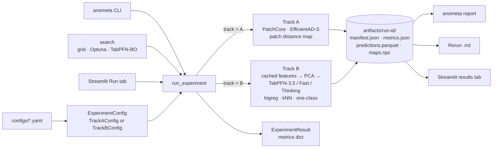
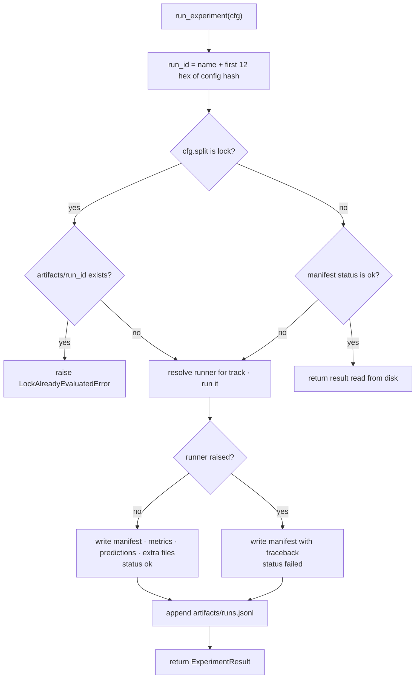
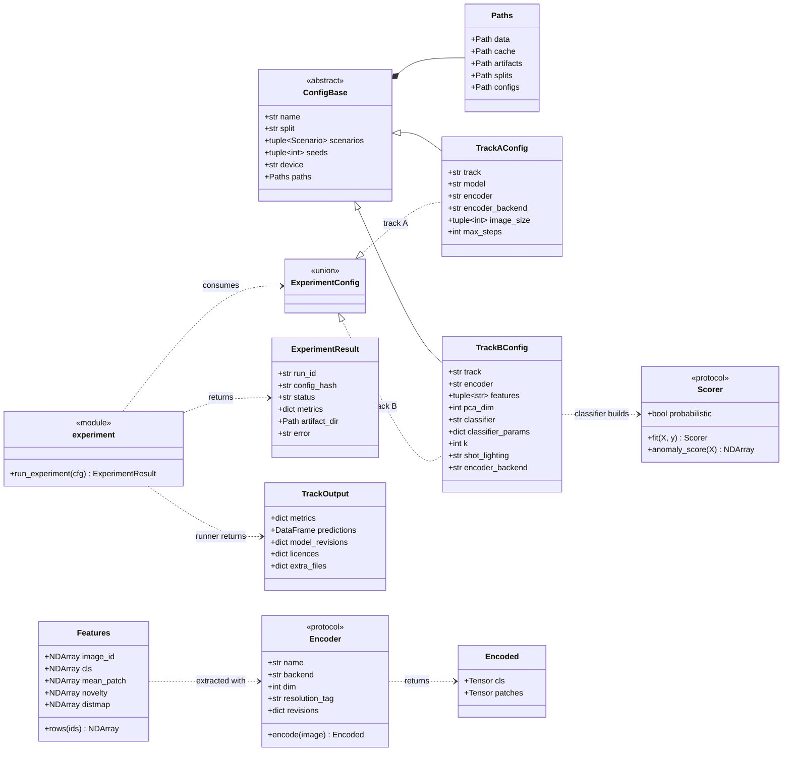
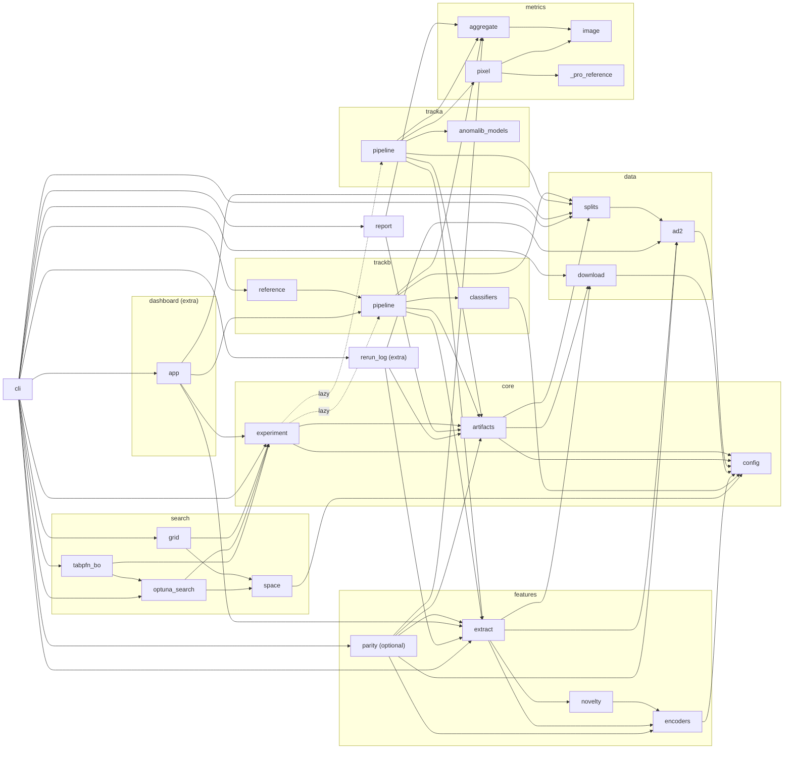

# Architecture

Anometa is one Python package, `anometa`, under `src/anometa/`. Every experiment goes through one function and writes one artifact directory.

## System overview

One experiment API: every entry point builds an `ExperimentConfig` and calls `run_experiment`, which dispatches on `track` and writes one artifact directory per run.



## The experiment API

`run_experiment(ExperimentConfig) -> ExperimentResult` is the core invariant. The CLI, the Streamlit Run tab and the search layer (grid, Optuna, TabPFN-surrogate Bayesian optimisation) all call it. Nothing else runs an experiment.

- `RUNNERS` in `anometa.experiment` maps each track to its runner: `A` to `run_track_a`, `B` to `run_track_b`, and `L` to `run_lighting` (the post-freeze lighting study). Entries are import strings, resolved on first use, so importing `anometa.experiment` doesn't import a track's dependencies.
- A runner returns a `TrackOutput`: metrics, per-image predictions, model revisions, licences and extra files.
- `ExperimentResult` holds the run id, the config hash, the status (`ok` or `failed`), the metrics, the artifact directory and the error text of a failed run.
- Metrics are a `dict[str, float]`, because the tracks report different metric sets. See [metrics](metrics.md).

Metric keys follow one scheme:

- `<metric>`: the mean over scenarios and seeds.
- `<scenario>/<metric>`: the value for one scenario.
- `gap_<metric>`: the robustness gap, regular minus shifted lighting.
- `n_nan_<metric>`: the number of NaN values (Track B).
- `fit_latency_ms`, `predict_latency_ms` (Track B medians per scenario and seed) and `peak_vram_mb` (CUDA only).

Bootstrap intervals are not part of a run. `anometa report` computes them from `predictions.parquet`, so search trials stay fast.

### `run_experiment` lifecycle

Resume, failure recording and the lock guard.



- **Lock guard.** A lock-split run refuses to start if any run directory with the same config hash exists, under any name and whatever its status. Deleting that directory is a deliberate, manual act. Only `anometa lock` builds lock configs; `anometa run` and the Streamlit Run tab refuse them, and the search layer builds dev configs only. See [protocol](protocol.md).
- **Dev-run resume.** A dev run whose manifest says `ok`, and whose `metrics.json` and `predictions.parquet` exist, is read back from disk. An interrupted grid or search therefore resumes where it stopped.
- **Track A resume inside a run.** Track A saves each scenario's results to `artifacts/<run-id>/scenarios/<scenario>/` as soon as they are computed. A rerun loads the finished scenarios and starts at the first unfinished one. A resumed run's `peak_vram_mb` covers only the scenarios computed in that process.
- **Failures.** A runner exception is caught and recorded as a failed run, with the traceback in the manifest. `KeyboardInterrupt` still stops the process.

## Configs

Experiment configs are YAML files under `configs/`, parsed into pydantic models.

- `ExperimentConfig` is a discriminated union on `track`: `TrackAConfig`, `TrackBConfig` or `LightingConfig`. All three are frozen and reject unknown fields (`extra="forbid"`).
- Shared fields: `name`, `split` (`dev` or `lock`), `scenarios` (default all 8), `seeds`, `device` (`auto`, `cuda`, `mps` or `cpu`) and `paths`.
- Validators reject combinations that can't run. For example, a one-class classifier requires `k: 0` and a single seed, and `encoder_backend: timm` requires a DINOv3 encoder.
- **Config hash.** The SHA-256 of the config's canonical JSON dump (sorted keys), without `name` and `paths`. Renaming a run or moving its files doesn't change the hash; every other field does.
- **Run id.** `<name>-<first 12 hex characters of the hash>`. Two configs that differ only in `name` share the hash but get different run ids.
- `configs/data/` holds the AD2 links and pinned archive hashes, `configs/experiments/` single experiments, `configs/search/` the grid spec and `configs/frozen/` the frozen configs for the lock evaluation.

### Core types

Configs are frozen pydantic models; `ExperimentConfig` is a discriminated union on `track`. Protocols mark the swap points (encoders, scorers).



## Artifact-first runs

Every run writes `artifacts/<run-id>/`:

- `manifest.json`: `run_id`, the full `config`, `config_hash`, `status`, `error`, `git_commit`, `git_dirty` (runs from before the history cleanup also carry `git_commit_original` and `git_commit_mapping`, see [provenance](provenance.md)), `dataset_hash` (from the pinned archive hashes), `split_hash` (from the split files), `model_revisions`, `licences`, `seeds`, `hardware`, `versions` (Python and key packages), `started_at` and `duration_s`.
- `metrics.json`: the metrics dict.
- `predictions.parquet`: one row per (scenario, seed, image) with `scenario, seed, image_id, scene_id, label, lighting, score`, plus `score_balanced` for Track B.
- `maps.npz` (Track A): float16 anomaly maps at model resolution, keyed `<scenario>/<image_id>`.
- `inspect.rrd`: only on demand, written by `anometa inspect`. See [dashboard and inspection](dashboard.md).

The manifest's `hardware` block records the platform, CPU count, resolved device, seed pool settings and, on CUDA, the GPU name and VRAM.

The manifest is written last, through a temporary file and an atomic rename. A run directory with a manifest is therefore always complete.

Every attempt, successful or failed, is appended to the run log `artifacts/runs.jsonl`. Data (`data/ad2/`), caches (`cache/`) and runs (`artifacts/`) are not committed. `configs/`, `splits/` and the generated `reports/` are.

## Feature cache

Feature extraction is the only step that needs a GPU. Everything downstream reads the cache.

- Path: `cache/features/<encoder>-<tag>/<scenario>-<archive sha256[:12]>.npz`.
- Tags: `r512` (DINOv3 via transformers, 512-pixel short side), `r512-timm` (DINOv3 via the timm fallback) and `p1024` (SigLIP2, up to 1,024 patches).
- Arrays: `image_id`, `cls` (N×D), `mean_patch` (N×D), `novelty` (N×2: the maximum and the top-1% mean of nearest-neighbour patch distances) and `distmap` (N×h×w, float16, a per-patch distance grid).
- Patch tokens are not stored. The novelty features and distance maps are computed from them during extraction.
- Encoders run in bfloat16 on CUDA and float32 elsewhere. Features are stored as float32.

## Package layout

```text
src/anometa/
├── config.py            Scenario, Paths, TrackAConfig, TrackBConfig, LightingConfig, config_hash, run_id
├── experiment.py        run_experiment, ExperimentResult, RUNNERS, lock guard
├── artifacts.py         TrackOutput, manifest capture, run directory writes and reads, runs.jsonl
├── data/
│   ├── ad2.py           scenario index, filename parsing, RGB loading
│   ├── download.py      resumable download, sha256 pin and verify, safe extract
│   └── splits.py        dev/lock split, split hash, few-shot sampling, evaluation rows
├── features/
│   ├── encoders.py      Encoder protocol, DINOv3 (transformers, timm fallback) and SigLIP2
│   ├── novelty.py       nearest-neighbour patch distances, novelty statistics, distance map
│   ├── extract.py       feature extraction and cache
│   └── parity.py        DINOv3 transformers versus timm comparison and speed benchmark
├── metrics/
│   ├── image.py         AUROC, AUPRC, NLL, ECE, Brier, prior correction
│   ├── pixel.py         AU-PRO, SegF1, ClassF1
│   ├── _pro_reference.py  vendored MVTec AD reference AU-PRO
│   └── aggregate.py     metrics dict from predictions, robustness gap, bootstrap intervals
├── trackb/
│   ├── classifiers.py   TabPFN and scikit-learn scorers, one-class controls
│   ├── pipeline.py      run_track_b
│   ├── lighting.py      run_lighting, the post-freeze lighting study
│   └── reference.py     TabPFNWithImages reference check
├── tracka/
│   ├── anomalib_models.py  PatchCore and EfficientAD-S fit and anomaly maps
│   └── pipeline.py      run_track_a
├── search/
│   ├── space.py         search space, unit-cube decoding, params to TrackBConfig
│   ├── grid.py          grid expansion and runner
│   ├── optuna_search.py NSGA-II and TPE studies
│   └── tabpfn_bo.py     TabPFN-surrogate Bayesian optimisation loop
├── report.py            results tables and figures from artifacts
├── cli.py               the anometa entry point
├── rerun_log.py         Rerun .rrd writer (extra anometa[dashboard])
└── dashboard/           extra anometa[dashboard]
    └── app.py           Streamlit dashboard
```

See [tracks](tracks.md) for what Track A and Track B compute, and the [API reference](api/index.md) for every module.

### Package dependencies

Arrows point from importer to imported module. `experiment` resolves the track runners lazily, so importing it stays light.


