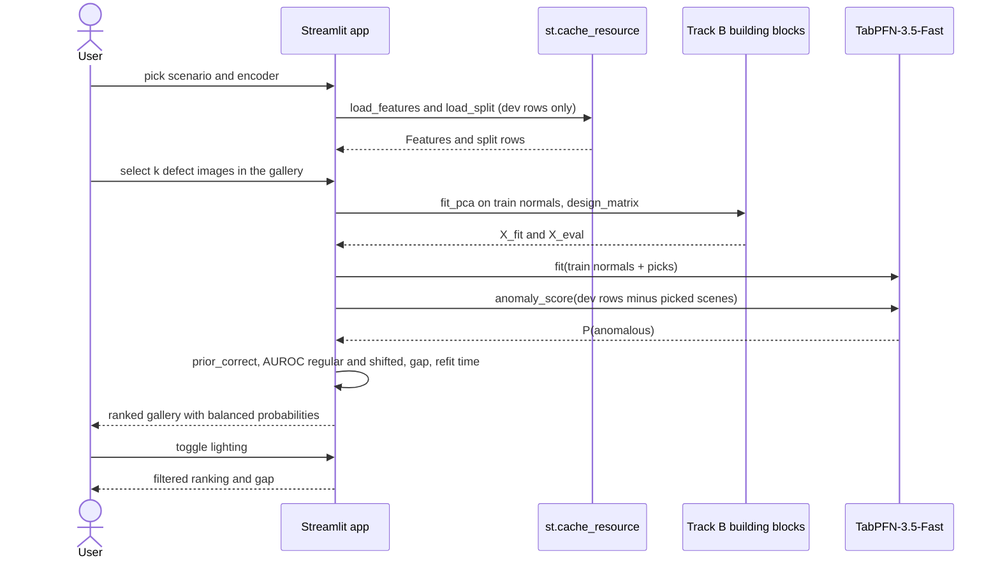

# Dashboard and inspection

The `dashboard` extra adds two tools: a Streamlit dashboard for few-shot detection and Rerun recordings for deep inspection of one run.

```bash
uv sync --extra dashboard
```

## Few-shot dashboard

```bash
uv run anometa demo
```

The command launches the Streamlit app in `anometa.dashboard.app`. It needs cached features, so run `anometa extract` first. It reads only cached features and dev images, never lock data.

The sidebar picks a scenario, an encoder and a backend among the cached features, a classifier (TabPFN-3.5-Fast by default, or TabPFN-3.5) and a lighting filter for the gallery (`regular`, `shifted` or `all`).

The app has three tabs.

### Few-shot labelling

1. The gallery shows the dev images of the scenario, without labels.
2. Select one or more images that look defective. They become the k few-shot shots.
3. The classifier refits on the train normals plus your picks and scores the rest of the dev images. The app shows the refit-and-rescore time.
4. A ranked table lists every scored image with its balanced probability of being anomalous.
5. Three numbers show the dev AUROC under regular lighting, under shifted lighting, and the gap between them.

Images from the scenes you picked are left out of the scoring, as in Track B. The demo fits on `cls` and `mean_patch` features with PCA to 16 dimensions; these are not exposed as controls.

The labelling loop calls the Track B building blocks directly, not `run_experiment`, because user-picked shots are not an `ExperimentConfig`. It uses the same fit-and-score helper as `run_track_b`, so the two paths can't diverge. Interactive picks are not recorded as runs.

Loaded features are cached with `st.cache_resource`, once per scenario, encoder and backend.

#### Demo labelling loop

The labelling loop reuses the Track B building blocks on cached features; the Run tab goes through `run_experiment` instead.



### Run

The Run tab launches one config from `configs/experiments/` through `run_experiment`, like `anometa run`. Overrides go in a text box, one `key=value` per line, with the same rules as `--set`. The tab refuses lock-split configs and shows the run id, status and metrics.

### Results

The Results tab shows the figures in `reports/dev/figures/`. Run `uv run anometa report --split dev` first.

## Rerun inspection

Rerun recordings (`.rrd`) are written only on demand:

```bash
uv run anometa inspect <run-id>
rerun artifacts/<run-id>/inspect.rrd
```

`anometa inspect` reads a finished run directory and writes `inspect.rrd` next to its artifacts. It prints the path and the command that opens it. The recording holds, on an `image` timeline:

- One step per evaluation image of the run's first seed, highest score first, up to `--max-images` (default 50).
- The RGB image, downscaled to at most 1,024 pixels on the longest side.
- Its ground-truth mask as a segmentation image.
- For Track A, the anomaly map as a 50% opaque overlay, with one colour range for all logged maps.
- The image's score.

Once per run, it also logs a 3-component PCA of the evaluation images' CLS features for each scenario, coloured by label and labelled with the lighting.

Open the file in the Rerun desktop viewer (`rerun`, from `rerun-sdk`).
