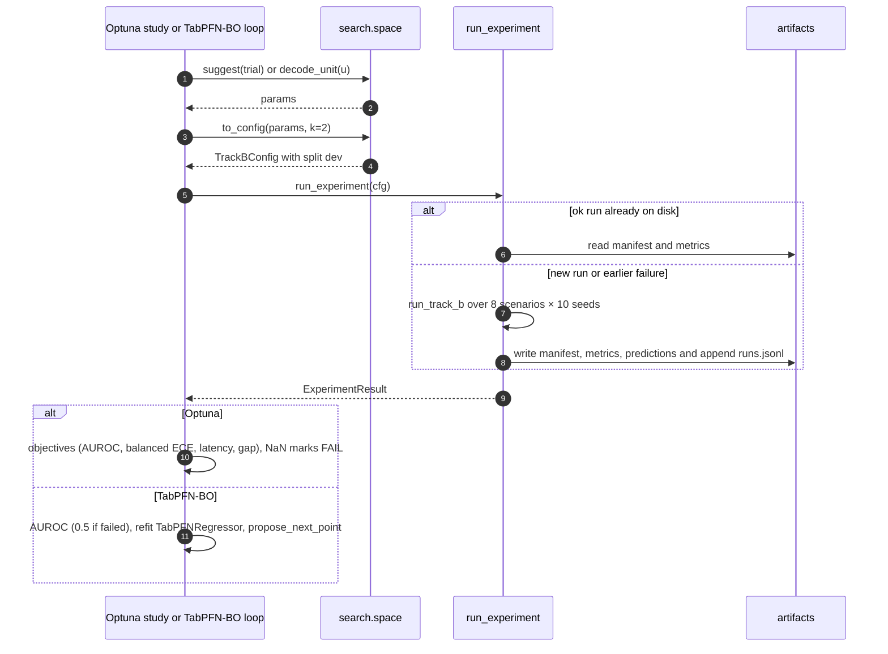

# Search on the dev split

Three search methods explore the Track B configuration space: a fixed grid, Optuna and a TabPFN-surrogate Bayesian optimiser. All three run on the dev split only. Each trial is one `run_experiment` call, so every trial is recorded and an interrupted search resumes. See [architecture](architecture.md) for the experiment API and [protocol](protocol.md) for the dev/lock split.

## Rules

- The search layer only builds dev-split configs. It never sees lock-split labels and never changes evaluation code.
- k is a label budget, not a hyperparameter: more labels help. Optuna and the Bayesian optimiser therefore run at a fixed k = 2 by default, which leaves 6 dev defect scenes per scenario to evaluate on. The grid covers every k.
- One trial is one run: all 8 scenarios and seeds 0–9 by default, so 80 fits.
- Search configs are named `search`, so their run ids are `search-<hash>`. Methods that propose the same point reuse the same run.

## Search space

`anometa.search.space.PARAMS` is a flat space with 7 dimensions:

| parameter | values |
|---|---|
| `encoder` | `dinov3_s`, `dinov3_l`, `siglip2` |
| `features` | `cls+mean_patch`, `cls+mean_patch+novelty`, `novelty` |
| `pca_dim` | 16, 32, 64, 128 |
| `classifier` | `tabpfn`, `tabpfn_fast`, `logreg`, `knn` |
| `n_estimators` (TabPFN) | 4, 8, 16 |
| `C` (logistic regression) | 1e-3 to 1e2, log scale |
| `n_neighbors` (kNN) | 1 to 15 |

Each classifier keeps only its own hyperparameter. Optuna samples the space directly. The Bayesian optimiser works on the unit cube `[0, 1]^7`, one coordinate per parameter:

- A categorical with n choices decodes as `min(floor(u·n), n−1)`.
- A log-scaled float decodes as `low·(high/low)^u`.

## Grid

```bash
uv run anometa grid configs/search/grid.yaml
uv run anometa grid configs/search/grid.yaml --dry-run   # prints the config count
```

The grid spec in `configs/search/grid.yaml` expands to 366 dev configs:

- 3 encoders × 2 embedding feature sets × 4 PCA dimensions × 4 classifiers × 3 budgets (k = 1, 2, 5), at default classifier settings.
- One `novelty`-only cell per encoder, classifier and k.
- The one-class controls (`mahalanobis`, `tabpfn_outlier`) at k = 0 and seed 0, with their own PCA dimensions.

The grid is cheap and exhaustive. Its runs feed the dev report.

## Optuna

```bash
uv run anometa optuna nsga2 --trials 200
uv run anometa optuna tpe --trials 60 --seed 0
```

- **NSGA-II** searches four objectives: maximise image AUROC, minimise balanced ECE, minimise predict latency and minimise the absolute robustness gap (`|gap_auroc|`). The sampler is `NSGAIISampler(population_size=24, seed=<seed>)`, set explicitly because Optuna defaults multi-objective studies to TPE. The command prints the dev Pareto front.
- **TPE** maximises image AUROC alone. It starts from 8 shared random points, enqueued before optimisation, with `n_startup_trials=8`. It writes every trial to `artifacts/search/tpe-k<k>-seed<seed>.parquet`.
- A failed run returns NaN objectives, so Optuna records it as a `FAIL` trial and the study goes on.
- Studies live in SQLite storage, by default `artifacts/optuna.db` (`--storage` changes it). A rerun on the same storage runs only the missing trials.

## TabPFN-surrogate Bayesian optimisation

```bash
uv run anometa bo --trials 60 --seed 0
```

TabPFN tunes its own pipeline here. The loop uses `propose_next_point` from `tabpfn_extensions.bayesian_optimization`, with a `TabPFNRegressor(differentiable_input=True)` as the surrogate. It runs on the local TabPFN backend.

- The first 8 points are the same shared starting points TPE uses for the same seed.
- After that, each step fits the surrogate on every `(u, AUROC)` pair seen so far and proposes the next point in the unit cube.
- A failed run counts as AUROC 0.5 (chance), so one failure doesn't stall the loop.
- `--device` picks where the surrogate runs.
- The trial table is rewritten after every trial to `artifacts/search/bo-k<k>-seed<seed>.parquet`. A rerun resumes from it.

### Search loop

Optuna (NSGA-II, TPE) and the TabPFN-surrogate loop share the search space, the initial points and `run_experiment`. They only ever build dev configs.



## Restricting scenarios

`grid`, `optuna` and `bo` accept `--scenario`, which can repeat:

```bash
uv run anometa optuna tpe --trials 20 --scenario vial --scenario fruit_jelly
```

A restricted search gets its own study name and parquet file, with the scenario names appended (for example `tpe-k2-seed0-vial+fruit_jelly`). It never mixes with an all-scenario search.

## What the searches found

All results below are dev-split, all 8 scenarios, k = 2. The full grid finished with 366 of 366 runs `ok`.

| study | trials | best AUROC | best after 10 | after 30 | after 60 |
|---|---|---|---|---|---|
| TPE seed 0 | 60 | 0.747 | 0.695 | 0.746 | 0.747 |
| TPE seed 1 | 60 | 0.747 | 0.712 | 0.712 | 0.747 |
| TPE seed 2 | 60 | 0.747 | 0.740 | 0.746 | 0.747 |
| TabPFN-BO seed 0 | 60 | 0.744 | 0.695 | 0.734 | 0.744 |
| TabPFN-BO seed 1 | 60 | 0.747 | 0.712 | 0.742 | 0.747 |
| TabPFN-BO seed 2 | 60 | 0.742 | 0.740 | 0.740 | 0.742 |
| NSGA-II | 200 | 0.748 (85 Pareto points) | | | |

- **One basin.** Every study converges on logistic regression with `dinov3_l`, `cls+mean_patch+novelty` and PCA 64, with a strongly regularised `C` (about 0.001 to 0.01), at about 0.747 AUROC.
- No search ranks a TabPFN trial first. This matches the grid.
- TPE and TabPFN-BO reach the same plateau, and BO doesn't converge faster. With one dominant basin, the space can't separate the two methods.
- All 85 NSGA-II Pareto points (AUROC against balanced ECE) are logistic regression. The sampler gave logistic regression 137 of its 200 trials and TabPFN 49, so TabPFN's side of the front is less explored. Tuning `n_estimators` barely changes TabPFN's scores.

## Why the search winners were not frozen

The frozen configuration comes from a fixed rule on dev data: the TabPFN-3.5 configuration with the highest mean dev AUROC over k = 1, 2 and 5, at default settings. That gives one configuration for every budget: `dinov3_l`, `cls+mean_patch+novelty`, PCA 16. It is also logistic regression's best configuration by the same rule, so every classifier is frozen at its own best and none is tuned against another.

The search winners were left out on purpose:

- Their `C` was tuned on dev labels from all 8 scenarios. A real few-shot user has only k labelled defects, not those labels.
- The searches could tune TabPFN's `n_estimators` too, but never ranked a TabPFN trial first. Freezing a tuned logistic regression next to a default TabPFN would compare a tuned control with an untuned model.

The search results stay in the report as dev findings. See [results](results.md) for the lock evaluation and the [experiment log](experiment-log.md) for every run on the way there.
