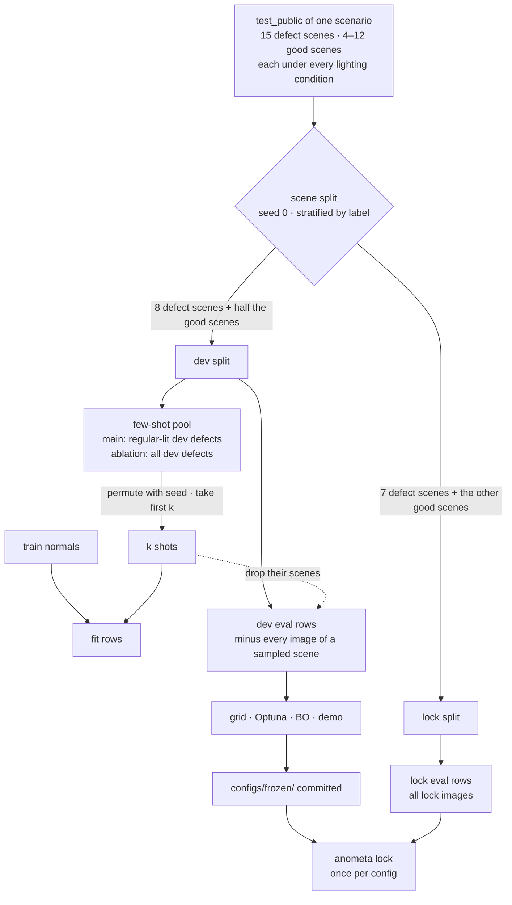

# Data and protocol

This page describes the data, the dev/lock split, few-shot sampling and the rules that keep the lock evaluation clean. Terms in bold are defined in the [glossary](glossary.md).

## MVTec AD 2

MVTec AD 2 has 8 **scenarios**: `can`, `fabric`, `fruit_jelly`, `rice`, `sheet_metal`, `vial`, `wallplugs` and `walnuts`. Anometa fits one model per scenario and evaluates all 8.

Each scenario has four sets:

- `train`: defect-free images, regular lighting only.
- `validation`: defect-free images, regular lighting only.
- `test_public`: labelled good and defective images under every lighting condition, with ground-truth masks for the defects.
- `test_private`: unlabelled images, scored only by MVTec's evaluation server. Anometa does not use it.

| Scenario | train | validation | test_public good / bad images | Image size (W×H) |
|---|---|---|---|---|
| can | 412 | 46 | 72 / 90 | 2232×1024 |
| fabric | 387 | 43 | 66 / 90 | 2448×2048 |
| fruit_jelly | 263 | 37 | 20 / 60 | 2100×1520 |
| rice | 313 | 35 | 42 / 90 | 2448×2048 |
| sheet_metal | 137 | 19 | 24 / 90 | 4224×1056 |
| vial | 291 | 41 | 35 / 105 | 1400×1900 |
| wallplugs | 293 | 33 | 60 / 90 | 2448×2048 |
| walnuts | 432 | 48 | 60 / 90 | 2448×2048 |

Sheet Metal, Vial and Wall Plugs are single-channel grey. Every loader converts images to RGB.

### File layout

- `train` and `validation` files are named `NNN_regular.png`.
- `test_public/{good,bad}/NNN_<lighting>.png` holds every lighting condition.
- Masks are `test_public/ground_truth/bad/NNN_<lighting>_mask.png`, with values 0 and 255. Good images have no mask; metrics treat them as all-zero.

### Scenes and lighting conditions

The **lighting condition** is the filename token after the index. Vial has `regular`, `underexposed`, `overexposed` and `shift_1` to `shift_4`. Across scenarios, the number of conditions ranges from 4 to 7. Every condition other than `regular` is **shifted lighting**.

A **scene** is one index within `good` or `bad`, for example `bad/007`. The same physical setup is captured under every lighting condition. Each scenario has 15 defect scenes and 4 to 12 good scenes.

`anometa.data.ad2.index_scenario` parses the layout into one row per image, with its source set, label, lighting and scene id.

## Dev/lock split

`test_public` is split once per scenario into a dev half and a lock half. `anometa.data.splits.make_split` does this, and `anometa split` writes the result to `splits/<scenario>.csv`. The split files are committed, and their hash goes into every run manifest.

- The split unit is the scene, not the image. All lighting variants of a scene go to the same half.
- Scenes are stratified by label. Within each label, a generator with seed 0 permutes the scenes, and the first half goes to dev. When a label has an odd number of scenes, dev gets the extra one.
- Each scenario therefore has 8 dev and 7 lock defect scenes.
- Every scene carries every lighting condition, so lighting is balanced without explicit stratification.

The **dev split** is used for few-shot sampling and for all model selection. The **lock split** is evaluated once, after the final configuration is frozen.

### Why split the public test set

MVTec AD 2 provides labelled anomalies only in `test_public`. Train and validation are defect-free. The private test set is scored only by MVTec's server, which needs pixel anomaly maps. Track B needs labelled anomalies for few-shot training, and it needs an untouched set for the final evaluation. Splitting `test_public` gives both.

The split has these consequences:

- Results are not directly comparable with published MVTec AD 2 numbers, which use the private test set.
- Splitting by scene keeps the same defect from appearing in both halves.
- There is one regular-lit defect image per scene, so the regular-lit label budget is capped at k ≤ 5. This leaves dev defect scenes to evaluate on.
- Lock sets are small: 7 defect scenes and 2 to 6 good scenes per scenario, each under 4 to 7 lighting conditions. Confidence intervals therefore resample both seeds and scenes (see [metrics](metrics.md)).
- The same scenes appear under every lighting condition, so the robustness gap is a paired comparison.
- Track A is also reported on the lock split, so both tracks share one evaluation set.

## Few-shot sampling

The **label budget** k is the number of labelled anomalous images given to a Track B classifier. Normal images are not counted.

- Main curve: k ∈ {1, 2, 5}. Shots come from regular-lit dev defect images only, so shifted lighting stays unseen during training.
- All-lighting ablation: k ∈ {10, 20}. Shots come from dev defect images under every lighting condition. This ablation runs on the lock split only, with the frozen configuration, and reports no robustness gap.
- The normal class uses all `train` images (the `n_normals` option uses a seeded subset; see [tracks](tracks.md)).

`anometa.data.splits.sample_few_shot` draws the shots. It sorts the pool by image id and permutes it once with a generator keyed by (seed, scenario). The shots are the first k images of that permutation. Samples are therefore nested: for the same seed and scenario, the k = 1 shot is the first of the k = 2 shots, and so on.

`anometa.data.splits.eval_rows` builds the evaluation set:

- Dev run: every dev image except all images of the scenes that supplied a shot. A sampled defect never appears in the evaluation set, under any lighting.
- Lock run: every lock image.

Each (scenario, k) runs with 10 seeds (0 to 9).

## Freeze, then lock

The order is fixed:

1. Run all experiments and searches on the dev split (see [search](dev-search.md)).
2. Choose the final configuration from dev results only and commit it to `configs/frozen/`.
3. Evaluate the lock split once.

The final Track B configuration is the TabPFN-3.5 configuration with the highest mean dev AUROC over k ∈ {1, 2, 5} at default settings. The same configuration is also logistic regression's best by this rule, so neither classifier is tuned against the other. [Tracks](tracks.md#frozen-configuration) lists the frozen files.

`anometa lock configs/frozen` runs every frozen configuration once. A lock run refuses to start if its artifact directory already exists, whatever its status. Deleting that directory is a deliberate, manual act. Only `anometa lock` builds lock configs; the search layer only builds dev configs.

The single lock evaluation ran all 28 frozen configurations once, and none was rerun or changed. The numbers are on the [results](results.md) page. Anometa makes no submission to MVTec's private evaluation server.

## Guardrails against leakage

- No feature, hyperparameter or split choice is based on lock-split results.
- Search layers never read lock-split labels and never modify evaluation code.
- Few-shot samples, PCA and every fitted scaler see dev or train rows only. Lock rows are loaded only by lock runs.
- Few-shot anomalies for the main label budgets are sampled from regular-lit dev images only.
- Novelty features for `train` images are computed leave-one-image-out, so train and test normals are scored the same way.
- API calls (TabPFN-3.5-Thinking) are cached, so reruns never depend on credits.
- Every experiment is recorded, including failed ones (see the [experiment log](experiment-log.md)).

## Post-freeze studies

Two studies ran after the single lock evaluation. Their protocols were fixed before any run. They are not part of the lock benchmark, and nothing in the frozen configuration changed because of them. Results are on the [results](results.md) page.

### Lighting adaptation

**Question:** when the lighting changes, does TabPFN-3.5 recover detection if a few good parts photographed under the new light are added to its context, without retraining?

- **Model:** the frozen Track B configuration (DINOv3-L, CLS and mean patch with PCA 16, plus novelty, default settings). PCA is fitted on the train normals only.
- **Scenes:** all `test_public` scenes of each scenario, dev and lock halves together. Reusing lock scenes is acceptable here only because the study tunes nothing: every setting was fixed before the first run.
- **Folds:** `anometa.data.splits.lighting_fold` draws one fold per scenario and fold seed s in 0 to 9. One generator keyed (s, scenario index, 11) permutes the good scenes and the defect scenes. The first 2 good scenes form the adaptation pool. The first k defect scenes provide the shots, using their regular-lit image. Every other scene is evaluated. No scene is ever both in the context and evaluated, under any lighting.
- **Target lighting L:** every lighting condition of the scenario, with `regular` as the reference. For target L, the context is all train normals (label 0), the k regular-lit shots (label 1) and the L-lit images of the first m adaptation scenes (label 0). The evaluation set is the L-lit images of every other scene.
- **Grid:** m ∈ {0, 1, 2} and k ∈ {1, 2}. Few-shot classifiers: `tabpfn`, `tabpfn_fast`, `logreg`, `knn`. One-class controls: `mahalanobis` and `tabpfn_outlier`, fitted on the train normals plus the adaptation images; for them, the shot scenes are only removed from evaluation. This gives 36 runs.
- **Metrics:** AUROC and balanced NLL per (scenario, fold, target lighting). Summaries are reported for `regular`, for `shifted` (the mean over every shifted lighting) and per lighting. The gap is regular minus shifted at m = 0. The share of the gap closed is (shifted at m − shifted at 0) / gap.
- **Pre-declared comparisons:** the primary one is TabPFN-3.5 at m = 2 minus m = 0 on shifted AUROC, at k = 2. Secondary ones are TabPFN-3.5 minus logistic regression and minus Mahalanobis at m = 2, the same at k = 1, and balanced NLL. All use a paired bootstrap over folds and scenes, with every (scenario, lighting) pair as its own stratum.

The study has its own config type, `anometa.config.LightingConfig` (track `L`), and runner, `anometa.trackb.lighting.run_lighting`. [Tracks](tracks.md#lighting-study-runner) describes the runner.

### TabPFN-3.5-Thinking ablation

**Question:** does TabPFN-3.5-Thinking, the API model with extra test-time compute, improve on local TabPFN-3.5?

- **Model:** the frozen Track B configuration with `classifier: tabpfn_thinking` (`thinking_effort="medium"`, `thinking_metric="roc_auc"`, 600 s timeout per fit). All 8 scenarios, dev split only. Shots and evaluation rows are exactly as in Track B.
- **Order and budget:** k = 2 first, then k = 1 and k = 5. Seeds run in order (0, 1, 2, …), as many as the daily token budget allows. The cost is checked with `anometa.trackb.classifiers.thinking_cost` before each batch. Every prediction is cached, so no call is paid twice.
- **Comparison:** TabPFN-3.5-Thinking minus local TabPFN-3.5 on the same configuration, seeds, shots and images, with a paired bootstrap over seeds and scenes. AUROC first, balanced NLL second. TabPFN-3.5-Thinking minus logistic regression is a secondary comparison.
- **Data sent to Prior Labs:** dev-split feature rows (18 numbers per image) and their labels, never images.

Thinking was not part of the frozen configuration, so it has no lock run. At the time of writing, seeds 0 to 4 at k = 2 are complete; the rest waits for token budget.
