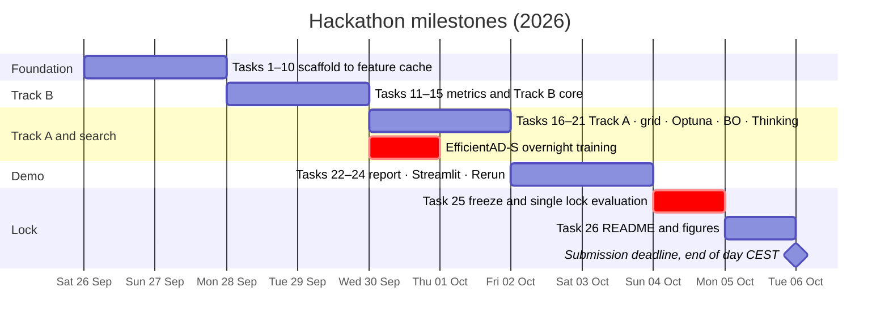
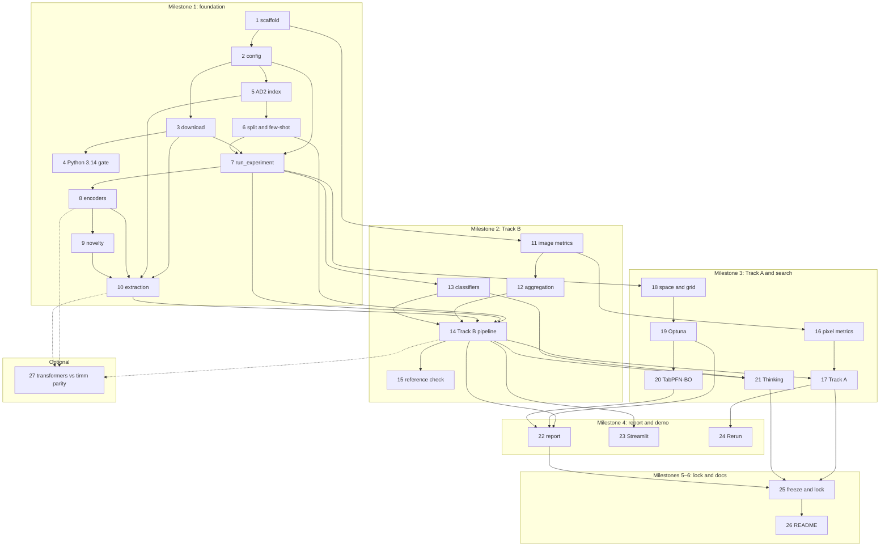

# Roadmap

This page lists what is not built yet. The hackathon results are on the [results](results.md) page, and every experiment so far is in the [experiment log](experiment-log.md).

## Near term

- **Hugging Face feature upload.** Publish the cached features, the Thinking prediction cache and the lock artifacts as a Hugging Face dataset, with a dataset card that states CC BY-NC-SA 4.0 and cites AD2. Anyone can then reproduce Track B on a laptop without extracting features. The upload needs the author's explicit approval.
- **Thinking ablation, remaining runs.** Finish seeds 5–9 at k = 2 (10 of 40 predictions are cached, about 32 fits remain). Then run k = 1 and k = 5, as the protocol requires. A fit costs about 200k tokens, so the 5M daily API token limit allows about 25 fits a day. A limit increase (about 35M tokens) is requested. It would also cover a one-fit feasibility test of Track C on the API.
- **Lighting study, last runs.** The three `tabpfn_outlier` runs at k = 1 are still running (about 15 h). They add the k = 1 version of one secondary comparison (TabPFN-3.5 minus the outlier score). The primary result does not depend on them.
- **Video narration.** Pick the narration voice and rebuild the video.

## Track C: TabPFN anomaly maps

Track C gives TabPFN-3.5 one row per image patch and learns a defect map from a few labelled shot images. The dev-only prototype beats the DINOv3 distance map by +0.056 (k = 2) and +0.071 (k = 5) AU-PRO@0.05 (see [results](results.md#track-c-prototype-tabpfn-anomaly-maps)). Track C learns from labelled defects of the public test set. It breaks the benchmark's unsupervised protocol, so it will not go to MVTec's evaluation server. Its success criterion is pixel metrics (AU-PRO@0.05, SegF1, ClassF1) on the lock split, next to Track A.

### Promote the prototype into the package

The prototype is a standalone script. The plan:

- Add `src/anometa/trackc/` with row building, context construction, map assembly and the runner.
- Add a config type for map-producing TabPFN runs and register it in `RUNNERS` in `experiment.py`, so runs are artifact-first like every other track.
- Write the tests first, on the fake AD2 tree in `tests/conftest.py`.
- Store the PCA-32 patch tokens in the feature cache instead of a side file (about 40 MB per scenario; extend `features/extract.py`).
- Fix an evaluation protocol before any lock run: label budgets k, number of seeds, and how per-image patch counts affect the intervals.

### Open design questions

Each question below is open. The prototype made a provisional choice for each one.

**Patch labelling.** How is a patch label derived from a ground-truth mask: a coverage threshold, dropped boundary patches, or soft labels? Should normal patches inside defect images be used?

- Provisional rule: a shot patch is a defect row if its mask coverage is at least min(0.3, half of that image's largest patch coverage). Clean patches of shot images are normal rows. Patches in between are left out.
- The first rule (fixed threshold 0.3) failed on Can: no patch reached 30% coverage, so the context had no defect rows. Soft labels were not tried.

**Patch features.** Which columns describe one patch: the PCA-reduced patch token (which layers, how many dimensions), the patch distance, neighbourhood context, position, image-level features?

- Provisional: 36 columns. PCA-32 of the DINOv3-L patch token (PCA fitted on 40 train images), the DINOv3 nearest-patch distance, the PatchCore map averaged to the patch grid, and the 3×3 maxima of both maps.
- Not tried: other layers, other PCA widths, position, image-level features.

**Training context.** Which normal and defect patches go into the context, and how many? Random sampling, coreset sampling or hard negatives chosen by patch distance? How are the classes balanced?

- Provisional: 15,000 random patches from half of the validation images (label 0), plus every labelled patch of the shot images. That gives about 17,000–20,000 rows with 100–600 defect rows.
- Research points to a larger context of 50K–100K rows per estimator (`SUBSAMPLE_SAMPLES`) with `majority_downsample`, which keeps every defect row in every estimator. This shifts the class prior. On `tabpfn` 9.0.0 the correction must be applied by hand. AUROC and AU-PRO do not depend on the prior; calibration metrics do.
- Coreset or per-image stratified selection of normal rows may beat random sampling. It must be decided on the dev split only.

**Map resolution and tiling.** At what input resolution, and with or without tiling, are maps computed?

- At a 512-px short side, one 16-px patch covers about 77 px of a 2448-px image, so small defects may vanish. On Can, no shot patch reached 30% mask coverage.
- The row count, and so TabPFN's cost, grows with resolution. The prototype used a 512-px short side and no tiling.

**Map post-processing and thresholds.** How is a patch-score grid turned into a pixel map (upsampling, smoothing)? How is the image score derived? How are SegF1 thresholds chosen?

- Provisional: maps are upsampled to full resolution and scored with the project's pixel metrics. The image score is the map maximum. The threshold is the validation mean + 3 std, on a validation half that is not in the context.
- This threshold rule suits distances, not probabilities. Every learned map lost SegF1 because of it (TabPFN-Fast 0.18 vs distance 0.26). A threshold rule for probability maps must be decided on the dev split before a freeze.
- Smoothing was not tried.

**TabPFN cost at patch scale.** Measure fit time, predict time for 100K rows and peak VRAM for TabPFN-3.5 and 3.5-Fast with `fit_with_cache` on the RTX 3090. Grid: n_train ∈ {10K, 50K, 100K, 300K} × features ∈ {64, 256}, memory-saving mode on and off, on synthetic data. This benchmark has not run. The only measured numbers so far come from the prototype: TabPFN-Fast takes 14–30 s and TabPFN-3.5 53–71 s per (scenario, k, seed), for about 100,000–250,000 scored patches.

**Other open questions.**

- Can one scenario-agnostic pipeline (rows pooled over scenarios) replace one model per scenario?
- Can the Streamlit demo let a user label few-shot defects by clicking patches or painting masks?

### TabPFN facts that shape the design

These facts were checked against `tabpfn` 9.0.0 and the TabPFN-3.5 report. Numbers marked derived are computed from the source code and not measured.

- Documented limits: 1,000,000 rows and 20,000 features for both TabPFN-3.5 and 3.5-Fast. The checkpoints do not subsample rows by default.
- Default ensembles: 8 estimators for 3.5, 4 for 3.5-Fast. 3.5 has 219.0M parameters and 24 in-context layers; 3.5-Fast has 83.5M and 8.
- KV cache per train row and estimator (derived): 3,840 bytes for 3.5, 1,792 bytes for 3.5-Fast. At 100K rows that is about 3.7 GB (3.5) and 1.0 GB (Fast) over all estimators. At 600K rows 3.5 needs about 19 GB, which leaves almost nothing on a 24 GB RTX 3090. So the context must be subsampled.
- Feature width is cheap: with 256 features or fewer, the feature count is under 1% of the cache. PCA width can be chosen for accuracy, not memory.
- Runtime grows quadratically with train rows above about 128k rows.
- `fit_with_cache` builds the KV cache once. Predict then runs test rows in chunks of 32,768 automatically, so a 100K-patch predict is about 4 chunks. Without the cache, every predict call reruns the train pass.
- Memory-saving mode switches on automatically on CUDA above a cell threshold (about 1.7M cells on an RTX 3090, derived). Every Track C configuration is above it.
- On CPU, runs above 5,000 samples raise an error by default. The CPU path is not usable at patch scale.
- Thinking mode does not support `fit_with_cache`.

## Track D: unsupervised TabPFN anomaly maps

### Question

Can TabPFN-3.5 produce anomaly maps that beat the DINOv3 patch distance map while learning from defect-free images only? Such a method follows the MVTec AD 2 protocol and could go to MVTec's evaluation server.

### Why it is worth doing

- The Track C prototype (dev split, all 8 scenarios, 3 seeds, k ∈ {2, 5}) showed that TabPFN on one row per patch learns a better map than its inputs. AU-PRO@0.05 rose by +0.056 (k = 2) and +0.071 (k = 5) over the DINOv3 distance map, and by +0.02 to +0.07 over logistic regression on the same rows. The intervals over (scenario, seed) units exclude zero. Numbers and caveats are in the [experiment log](experiment-log.md#track-c-prototype-all-8-scenarios).
- Track C learns from labelled defects of the public test set, so it breaks the unsupervised protocol. Track D keeps Track C's row design but replaces the real defect rows with rows that need no test labels.

### Protocol (fixed before any Track D run)

- Fit data: only `train` images enter the context. `validation` (defect-free) is split into two halves by image id. One half sets the SegF1/ClassF1 threshold. The other half serves model checks during development. No `test_public` image enters a context.
- Development on the dev split, then a freeze commit, then one evaluation on the lock split. This is the same discipline as Track B (see [protocol](protocol.md)).
- Server submission only if the frozen Track D beats the DINOv3 distance map on the lock split (lock AU-PRO@0.05 0.385), and only with the author's explicit approval per upload.

### Row design

Track D keeps the Track C rows unchanged:

- One row per DINOv3-L patch (16×16 px at a 512-px short side; about 1,200–1,400 patches per image, 4,096 for Sheet Metal). Per-pixel rows would repeat each patch's values 256 times.
- 36 columns: PCA-32 of the patch token (PCA fitted on train patches), the DINOv3 nearest-patch distance (`distmap` in the feature cache), the PatchCore map averaged over the patch, and the 3×3 maxima of both maps.

**Leakage trap.** A train image's own patches sit in PatchCore's memory bank and in the DINOv3 patch bank, so their distances are near zero. Train rows must use leave-one-image-out values. The cached `distmap` is already leave-one-out for train images. PatchCore needs a leave-one-out bank or a k-fold bank split: fit the bank on the other folds and score the held-out fold.

### Variants, in order of cost

1. **D1, feature-space perturbation (start here).** Label 0: normal train patch rows, with leave-one-out values. Label 1: copies of normal rows with added noise (SimpleNet-style), for example Gaussian noise on the PCA token block plus a shift on the distance columns. Hyperparameters: the noise scale (as a fraction of each column's standard deviation), the share of perturbed rows (for example 5–20%), and which column blocks get noise. Tune on the dev split only. This is the cheapest variant: the Track C code needs only a different label source.
2. **D2, synthetic defects in image space.** Paste or blend artificial defects onto train images (CutPaste, or Perlin-noise masks as in DRAEM). Re-encode those images and label patches from the synthetic masks with the Track C labelling rule. This is closer to real defects. It needs a defect generator and re-encoding (about one GPU hour for all scenarios). Watch the gap between synthetic and real defects per scenario (thin scratches vs blobs).
3. **D3, TabPFN density at patch level.** Run `tabpfn_outlier` (tabpfn-extensions, chain rule over features) on patch rows, with no labels at all. Known cost problem: with 18 features at image level, one run already takes 4–6 h on the RTX 3090 (lighting study). At patch level, use few columns (PCA 4–8 plus the two distances) and a context of about 5,000 subsampled train patches. This variant is a reference point rather than the main bet.

### Evaluation

- Pixel metrics with `src/anometa/metrics/pixel.py` (`au_pros`, `validation_threshold`, `pixel_metrics`). Maps are upsampled bilinearly to full resolution and stored as float16, like the server expects.
- Baselines on the same images: the DINOv3 distance map, PatchCore, EfficientAD-S, the z-scored fusion of distance and PatchCore, and logistic regression on the same rows (a cheap learned control).
- Intervals: the Track C prototype resampled (scenario, seed) units. Track D needs a scene-level bootstrap for pixel metrics (resample scenes, recompute AU-PRO). It does not exist yet.
- Threshold: the validation mean + 3 std rule suits distances but not probabilities. Decide a threshold rule for probabilities on the dev split before the freeze (see the post-processing question under Track C).

### Server submission conditions

- Only after the lock result, and only if the conditions in the protocol above hold.
- Inputs: float16 single-channel TIFF maps for every `test_private` and `test_private_mixed` image of all 8 scenarios, plus thresholded PNGs (the server derives ClassF1 from them).
- Results are public and permanent. The server allows 2–3 uploads per week.
- Method description: "unsupervised; TabPFN-3.5 on frozen DINOv3-L patch features, trained on defect-free images only", naming the variant.
- Submitting the patch distance map is simpler and can go first (see below).

### Implementation plan

Track D builds on the Track C package (see [Promote the prototype into the package](#promote-the-prototype-into-the-package)):

- Reuse `src/anometa/trackc/` for row building, context construction, map assembly and the runner. Track D adds a label source per variant.
- Add leave-one-out or k-fold PatchCore banks for train rows.
- Register the runs in `RUNNERS`, so they are artifact-first. Write the tests first, on the fake AD2 tree.
- Add the scene-level bootstrap for pixel metrics.

### Cost estimate (RTX 3090)

- D1: about 3–4 h for all 8 scenarios × 3 seeds with TabPFN-3.5-Fast. Track C took 3.5 h including token extraction and PatchCore refits, which are cached now.
- D2: about 1 h more to generate and encode the synthetic images.
- D3: hours per scenario, unless the column count and the context stay small.

### Open questions

- Which noise model in D1 transfers best to real defects? Does one setting work for all 8 scenarios, or does each need its own?
- Does a single scenario-agnostic context (rows pooled over scenarios) help, given TabPFN's row limits?
- How should the maps be smoothed or post-processed before thresholding?

## MVTec evaluation server and tuned baselines

### Submitting the patch distance map

The training-free DINOv3 patch distance map follows the protocol: it uses only `train` and `validation` images. It could go to MVTec's evaluation server, which scores the private test set. Open points:

- Whether to submit at all. Results are public and permanent.
- The method name and description.
- When to submit, and which of the 2–3 weekly uploads to use.
- The map post-processing and threshold decisions come first.

### Tuned baselines

Our PatchCore and EfficientAD-S run untuned, with anomalib defaults and one setting for all scenarios. They score below the AD2 paper's numbers for the same methods on 6 and 7 of 8 scenarios. A conclusive comparison with the paper needs:

- Tuned PatchCore and EfficientAD-S, including EfficientAD's ImageNet penalty set instead of Imagenette.
- A tuned pipeline of our own (the DINOv3 pixel methods were not tuned either).
- Scores on the private test set through MVTec's server, not on the public lock half.

## Broader scope: a meta-framework

The name has two meanings. "Meta-learning" describes TabPFN today. "Meta-framework" describes the direction: the experiment API, artifacts and protocol are not tied to one model or dataset. The long-term vision lists these items, which are not built yet:

- **More datasets**, including datasets with labelled anomalies in the training data. Those would make Track A and Track B directly comparable.
- **Classical image statistics as features:** RGB mean and standard deviation, percentiles, brightness, contrast, histogram, gradient and edge-density statistics.
- **Classical transforms as parallel feature branches:** decorrelation stretch, Retinex illumination correction, CLAHE, colour constancy, Lab and opponent-colour representations. Each branch is tested for complementarity with the original image, not as fixed preprocessing.
- **Frequency-domain descriptors:** DWT and FFT statistics next to DINOv3 features, then PCA and TabPFN.
- **The full spatial descriptor set:** top-k patch means, spatial variance, centre versus border, quadrant and concentration statistics, beyond today's patch-novelty statistic.
- **More classifier controls:** an MLP and LightGBM.
- **Scenario transfer:** within-scenario against cross-scenario models, and pooled cross-scenario models.
- **A resolution and compute study:** 256, 512 and higher input resolutions, and tiling, against accuracy, AU-PRO, lighting robustness, latency and VRAM.
- **Constraint-based optimisation:** thresholds on lighting robustness, calibration, VRAM and latency. The NSGA-II search already trades off AUROC, calibration error, predict latency and an AUROC gap, but it has no constraints and no memory objective.
- **An AutoGluon search stage** over PCA dimension, pooling, feature construction, classifier choice and hyperparameters, with no access to the lock split.
- **An autoresearch-style agent loop:** propose a change, run a fixed-budget experiment, evaluate, keep or reject, repeat. A research contract binds the agent: no test-set access, no changes to evaluation code, ground truth or splits.
- **A Rerun-based desktop UI** as the main viewer: images, masks, anomaly maps, embedding exploration, experiment timelines and run comparison. Today Rerun records one run on demand (`anometa inspect`).
- **Trainable adapters,** and only then encoder fine-tuning, compared against the frozen representations.

## History

The two diagrams below show the hackathon plan as executed.

### Timeline

### Task dependencies

