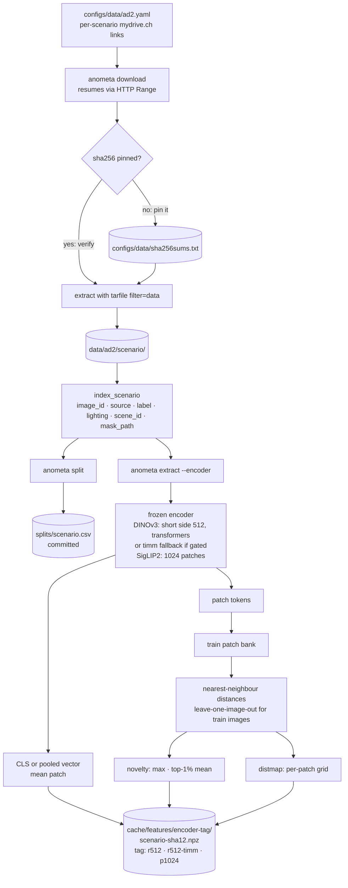
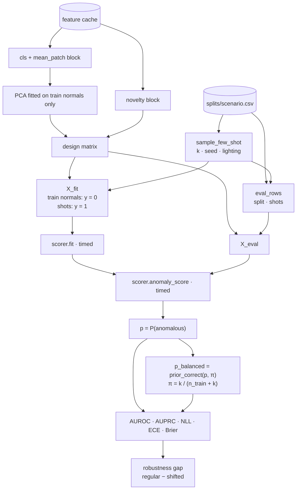

# Tracks and models

Anometa keeps two tracks apart in code and in reporting. **Track A** learns from defect-free images only and outputs anomaly maps. **Track B** trains a classifier on frozen foundation-model features from labelled normal and anomalous images and outputs an image score. Both tracks run through `anometa.experiment.run_experiment` (see [architecture](architecture.md)). The data and splits are described in [protocol](protocol.md), and the metrics in [metrics](metrics.md).

## Shared features

Track B and the Track A distance map read the same feature cache. Only the extraction step needs a GPU; everything downstream reads the cached `.npz` files.



### Encoders

All encoders are frozen and run without gradients. On CUDA they run in bfloat16 (float16 overflows DINOv3-L).

| Config name | Model | Hidden size | Input |
|---|---|---|---|
| `dinov3_s` | DINOv3 ViT-S/16 | 384 | short side 512, aspect ratio kept, both sides rounded to multiples of 16 |
| `dinov3_l` | DINOv3 ViT-L/16 | 1024 | as `dinov3_s` |
| `siglip2` | SigLIP2 so400m-patch16-naflex | 1152 | NaFlex, at most 1,024 patches, aspect ratio kept |

- DINOv3 loads from the gated `facebook/dinov3-*` repositories through transformers by default. timm's ungated copies of the same weights are the fallback. The backend is part of the config (`encoder_backend`) and of the cache tag, so a run never mixes the two.
- The "CLS" vector is the CLS token for DINOv3. SigLIP2 has no CLS token, so its slot uses the attention-pooled `pooler_output`.
- DINOv3 at a 512-pixel short side gives 16×16-pixel patches, for example 512×2048 (4,096 patches) for Sheet Metal. SigLIP2's short side falls below 512 for wide images, because NaFlex does not extrapolate well beyond 1,024 patches.

### Feature blocks

- `cls`: the CLS (or pooled) vector.
- `mean_patch`: the mean of the patch tokens.
- `novelty`: the **patch novelty score**, two numbers per image. `anometa.features.novelty` computes the Euclidean distance from each patch token to its nearest `train` patch of the same scenario. The two numbers are the maximum and the mean of the top 1% of these distances.

`train` images get leave-one-image-out novelty: their own patches are masked out of the bank. Otherwise train normals would score near zero, and a classifier would learn that any novelty means "anomalous".

The same nearest-patch distances, reshaped to the patch grid, give the **patch distance map** (`distmap`) used by Track A. Patch tokens themselves are not cached.

## Track A: unsupervised baselines

Track A models learn from defect-free `train` images only and output an anomaly map per image. The image score is the maximum of the full-resolution map. Each model runs once per scenario, with one seed. `anometa.tracka.pipeline.run_track_a` is the runner, and `anometa.tracka.anomalib_models` holds the anomalib settings.

### PatchCore and EfficientAD-S

Both come from anomalib and follow the MVTec AD 2 paper's settings where practical. They are **not tuned**: one setting serves all scenarios. Both score below the paper's numbers for the same methods (see [results](results.md)).

- Input: every image is resized to 256×256 without keeping the aspect ratio, as in the paper, and without a center crop.
- PatchCore: `Patchcore(backbone="wide_resnet50_2", layers=("layer2", "layer3"), coreset_sampling_ratio=0.01, num_neighbors=9)`. It runs one epoch, which fills its memory bank. anomalib supports one backbone, not the paper's three-backbone ensemble.
- EfficientAD-S: `EfficientAd(model_size="small", lr=1e-4, weight_decay=1e-5)`, training batch size 1, 70,000 steps. Its penalty set is Imagenette, not ImageNet. It validates once, after the last step.
- Post-processing is disabled (`post_processor=False`). anomalib's post-processor min-max normalises maps with validation statistics, and AD2 validation is all normal. Maps stay raw, and Anometa computes every metric itself.
- Maps come out at 256×256 and are resized to the original image size before any metric.

### DINOv3 patch distance map

The patch distance map is each patch's distance to the nearest normal patch of the same scenario. It reuses the distances computed for the novelty feature, so it needs no training. It runs for `dinov3_s` and `dinov3_l` (Track A `model: patch_distance`). On the lock split, the DINOv3-L map is the best of our pixel methods. It is not the best method in the literature: it beats the paper's best method on 4 of 8 scenarios, the test sets differ, and the baselines are untuned (see [results](results.md)).

### Evaluation

Track A reports AU-PRO@0.05 and @0.30, SegF1, ClassF1 and image AUROC, on all images and split by regular and shifted lighting. The SegF1 and ClassF1 threshold comes from validation maps only. [Metrics](metrics.md#pixel-metrics) gives the details.

## Track B: few-shot adaptation

Track B fits a classifier on frozen features from all `train` normals plus k labelled defects. `anometa.trackb.pipeline.run_track_b` is the runner.



### PCA and the design matrix

- PCA is fitted once per scenario, on the `train` normals only. The grid uses dimensions {16, 32, 64, 128}.
- PCA covers the `cls` and `mean_patch` block only. The two novelty values are appended after PCA.
- `novelty` alone uses no PCA (`pca_dim: null`).
- `anometa.trackb.pipeline.fit_pca` and `anometa.trackb.pipeline.design_matrix` are the building blocks. The Streamlit demo reuses them (see [GUI](gui.md)).

### Classifiers

`anometa.trackb.classifiers.make_scorer` builds one scorer per classifier name. Each scorer returns one anomaly score per image.

| Name | Model | Notes |
|---|---|---|
| `tabpfn` | TabPFN-3.5, local | Primary model. Default settings, `random_state=seed`. |
| `tabpfn_fast` | TabPFN-3.5-Fast, local | The latency point. Default settings. |
| `tabpfn_thinking` | TabPFN-3.5-Thinking, Prior Labs API | Post-freeze ablation only. Predictions cached. |
| `logreg` | logistic regression | `StandardScaler`, `C=1.0`, no class weights. |
| `knn` | k-nearest neighbours | `StandardScaler`, `n_neighbors=5` (capped at the number of fit rows), no class weights. |
| `mahalanobis` | one-class control | `StandardScaler` and a Ledoit-Wolf covariance on train normals. The score is the squared Mahalanobis distance. |
| `tabpfn_outlier` | one-class control | `tabpfn_extensions.unsupervised.TabPFNUnsupervisedModel` with a TabPFN-3.5 regressor, fitted on train normals. The score is the negative of `outliers(X, n_permutations=10)`. |

- TabPFN classifiers are built with `TabPFNClassifier.create_default_for_version`. The run manifest records the checkpoint file, its sha256 and the `tabpfn` version.
- The searches also tune TabPFN's `n_estimators`, logistic regression's `C` and kNN's `n_neighbors` (see [search](dev-search.md)). The frozen configuration uses the defaults.
- **One-class controls** use normal images only (label budget zero). They test whether labelled anomalies add value. They do not depend on k or seed, so they run once per scenario with one seed. They output unbounded scores, not probabilities, so they report AUROC and AUPRC only.

### TabPFN-3.5-Thinking and its cache

`tabpfn_thinking` calls `tabpfn_client.TabPFNClassifier.create_default_for_version("v3.5", thinking_effort="medium", thinking_metric="roc_auc", random_state=seed)` with a 600 s timeout per fit. `anometa.trackb.classifiers.ThinkingScorer` wraps it.

- Each prediction is cached to `cache/thinking/<key>/<scenario>-<seed>.npz`. The key is the config hash without seeds, scenarios, device and classifier parameters. A rerun, or another run that shares a (scenario, seed), reads the cache and makes no API call.
- The cache is keyed by configuration, not by array bytes, so cached results survive small float differences between machines.
- `anometa.trackb.classifiers.thinking_cost` estimates the token cost before a run. Every operation costs at least 10,000 tokens, and the default budget is 5M tokens per day.
- Calls wait and retry after a per-minute rate-limit reply, and stop at once on the daily token limit.
- Fit and predict latencies are recorded as NaN, because they time the network, not the model.
- Only feature rows and labels go to Prior Labs, never images.

### Prior correction

The training prior is small: π = k / (n_train + k), where n_train is the number of normals in the fit set. It is below 4% for the main budgets, far below the share of anomalous images in the evaluation sets. Raw probabilities therefore mostly reflect this prior shift.

`anometa.metrics.image.prior_correct` maps each probability p to a 50/50 prior:

```text
p' = (p/π) / (p/π + (1 − p)/(1 − π))
```

π comes from training class counts only. Calibration metrics are reported on both p and p' (see [metrics](metrics.md#image-metrics)).

### Context size: `n_normals`

`classifier_params: {n_normals: m}` fits a few-shot scorer on a seeded subset of m train normals instead of all of them. `anometa.trackb.pipeline.context_normals` draws the subset on a random stream separate from shot sampling. PCA still fits on all train normals, and the prior correction uses the normals the scorer actually saw.

m = 32 was fixed in advance after a dev probe, not tuned further, and runs as an extra TabPFN and TabPFN-Fast row. On dev it traded about 0.01 AUROC for better balanced NLL. On the lock split it did not replicate (see [results](results.md)).

### Frozen configuration

The final Track B configuration is DINOv3-L (`dinov3_l`), features `cls`, `mean_patch` and `novelty`, PCA 16, default classifier settings, seeds 0 to 9. [Protocol](protocol.md#freeze-then-lock) explains how it was chosen. `configs/frozen/` holds 28 configurations:

| File | Contents |
|---|---|
| `trackb_final.yaml` | `tabpfn`, `tabpfn_fast`, `logreg`, `knn` × k ∈ {1, 2, 5} (12 configs) |
| `trackb_n_normals.yaml` | `tabpfn` and `tabpfn_fast` with `n_normals: 32`, k ∈ {1, 2, 5} (6 configs) |
| `trackb_one_class.yaml` | `mahalanobis` and `tabpfn_outlier` on DINOv3-L `novelty`, no PCA, k = 0, seed 0 (2 configs) |
| `trackb_ablation.yaml` | `tabpfn` and `logreg` with `shot_lighting: all`, k ∈ {10, 20}, lock only (4 configs) |
| `tracka.yaml` | PatchCore, EfficientAD-S, and the patch distance maps for `dinov3_s` and `dinov3_l` (4 configs) |

The one-class controls use their own dev-best features (novelty only) rather than TabPFN's, so the comparison does not flatter TabPFN.

## Lighting study runner

The post-freeze lighting-adaptation study (see [protocol](protocol.md#lighting-adaptation)) has its own track, `L`. Its config is `anometa.config.LightingConfig`, whose defaults are the frozen Track B configuration. Its runner is `anometa.trackb.lighting.run_lighting`.

- It reuses Track B's features, PCA and design matrix.
- For each scenario, fold seed and target lighting, it fits one scorer on the train normals, the fold's regular-lit shots and the target-lit images of the first m adaptation scenes (`adapt_normals`). It then scores the target-lit images of every held-out scene.
- `scene_pool: all` draws folds from every `test_public` scene; `dev` restricts them to the dev half. The study uses `all`.
- Each (scenario, lighting) pair has its own fitted context, so metrics are computed per pair and then averaged. The run reports `regular/<metric>`, `shifted/<metric>`, `gap_auroc` and `<lighting>/auroc`.
- `tabpfn_thinking` is not part of the study.

## Track C prototype

**Track C** is mask-supervised few-shot patch classification: a classifier on frozen patch features, labelled from the ground-truth masks of the k shots, that outputs an anomaly map. It is not part of the package or the lock benchmark. A dev-only scratch prototype tested the idea after the freeze. Its code is not committed.

### Row design

- One row per DINOv3-L patch (16×16 pixels at a 512-pixel short side, about 1,200 to 1,400 per image).
- 36 columns: a PCA-32 projection of the patch token (PCA fitted on 40 train images), the DINOv3 nearest-patch distance, the PatchCore map averaged to the patch grid, and the 3×3 neighbourhood maxima of both maps.
- Patch labels: a shot patch is a defect row if its mask coverage is at least min(0.3, half of that image's largest patch coverage). Patches with no mask coverage are normal rows. Patches in between are left out.
- Context: 15,000 patches from half of the validation images (label 0), plus the labelled patches of the k shot images.
- The other half of the validation images sets the SegF1 and ClassF1 threshold (mean + 3 std) for every method.
- Evaluation: the dev images left after the shots, under every lighting condition, scored at full resolution with the same pixel metrics as Track A.
- Baselines on the same images: the DINOv3 distance map, the PatchCore map, their z-scored average (no labels), and a per-patch logistic regression on the same rows.

### Results summary

All 8 scenarios, dev split, k ∈ {2, 5}, 3 seeds:

- TabPFN-3.5-Fast maps beat the DINOv3 distance map by +0.056 (k = 2) and +0.071 (k = 5) AU-PRO@0.05. Both intervals exclude zero.
- They beat logistic regression on the same rows by +0.021 (k = 2) and +0.065 (k = 5).
- Vial is the only scenario with a clear loss against the distance map, which is already near saturation there.
- SegF1 is lower for every learned map than for the distance map. The mean + 3 std threshold rule suits distances better than probabilities.

Caveats:

- Dev split only, with 3 seeds, and no held-out confirmation.
- The intervals resample (scenario, seed) units, not scenes.
- The labelling rule changed once, after the first rule left Can with no defect rows. The change was made after a crash, not after looking at scores.
- A clean confirmation needs its own frozen protocol and a held-out set.

The [roadmap](roadmap.md) describes the follow-up work.
