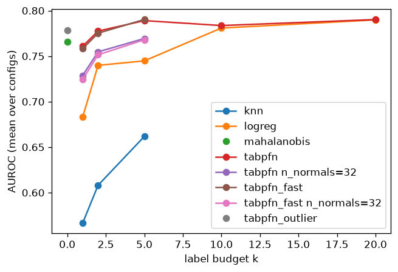
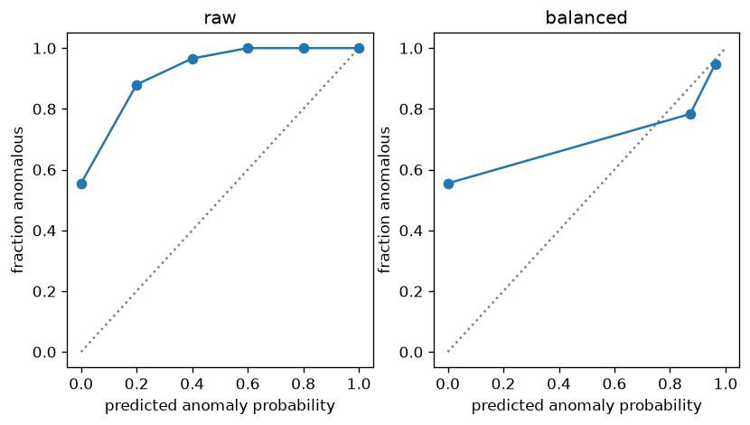
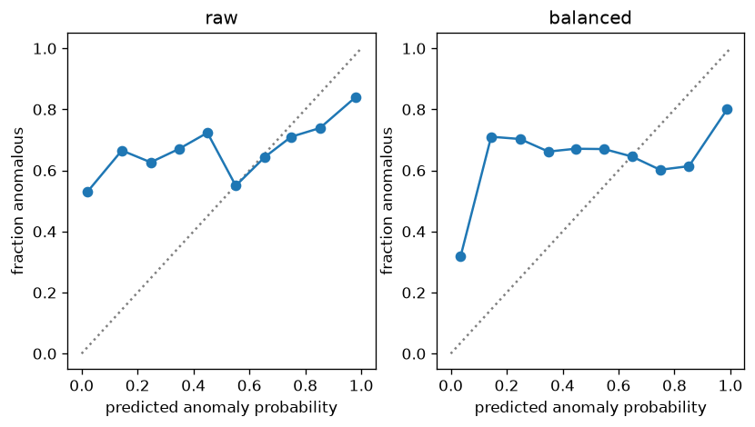
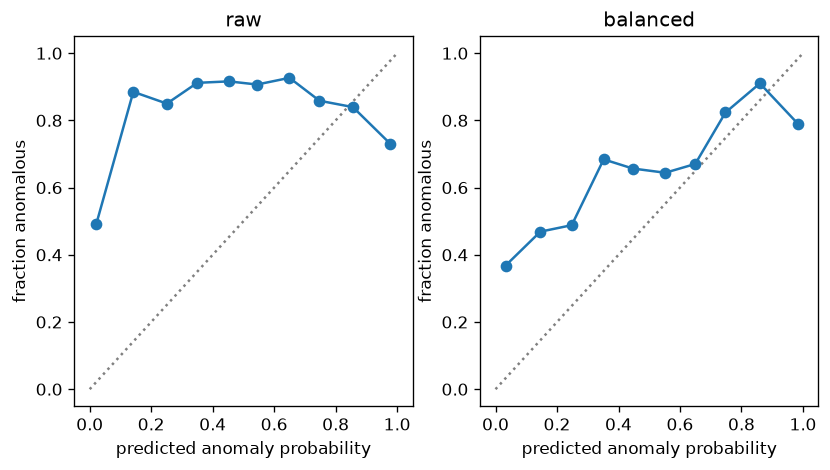
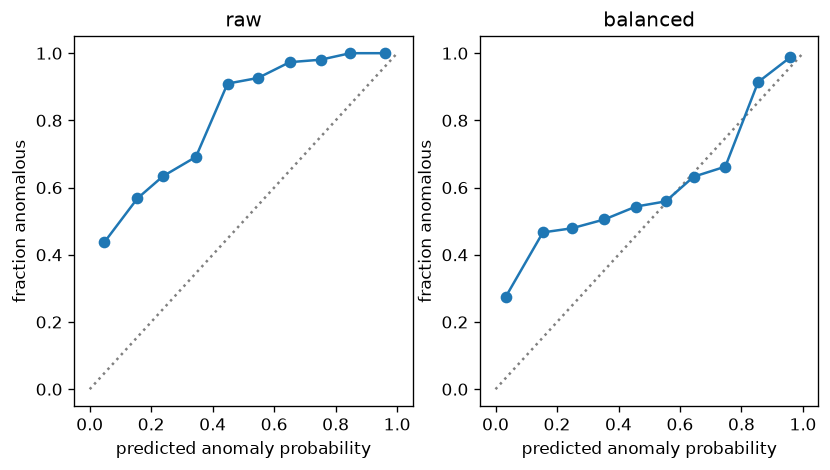
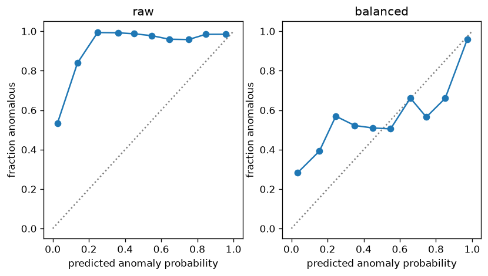
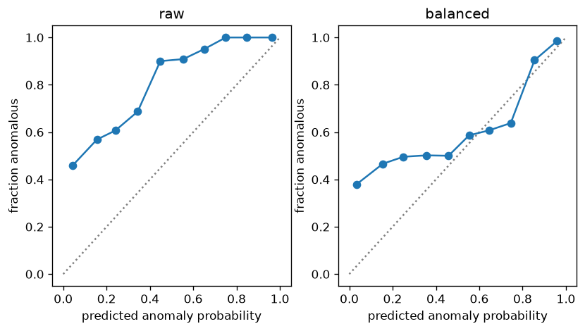

# Results: lock split

28 completed runs.

## Label budget

Best configuration per classifier and k, with a 95% bootstrap CI; `<one-class>_auroc` scores the matching one-class control on the same rows.

| classifier | k | shot_lighting | encoder | features | pca_dim | auroc | auroc_lo | auroc_hi | mahalanobis_auroc | tabpfn_outlier_auroc |
| --- | --- | --- | --- | --- | --- | --- | --- | --- | --- | --- |
| knn | 1 | regular | dinov3_l | cls+mean_patch+novelty | 16 | 0.567 | 0.538 | 0.598 | nan | nan |
| knn | 2 | regular | dinov3_l | cls+mean_patch+novelty | 16 | 0.608 | 0.572 | 0.646 | nan | nan |
| knn | 5 | regular | dinov3_l | cls+mean_patch+novelty | 16 | 0.662 | 0.610 | 0.708 | nan | nan |
| logreg | 1 | regular | dinov3_l | cls+mean_patch+novelty | 16 | 0.683 | 0.633 | 0.732 | nan | nan |
| logreg | 2 | regular | dinov3_l | cls+mean_patch+novelty | 16 | 0.740 | 0.688 | 0.785 | nan | nan |
| logreg | 5 | regular | dinov3_l | cls+mean_patch+novelty | 16 | 0.745 | 0.681 | 0.802 | nan | nan |
| logreg | 10 | all | dinov3_l | cls+mean_patch+novelty | 16 | 0.781 | 0.725 | 0.830 | nan | nan |
| logreg | 20 | all | dinov3_l | cls+mean_patch+novelty | 16 | 0.790 | 0.730 | 0.842 | nan | nan |
| tabpfn | 1 | regular | dinov3_l | cls+mean_patch+novelty | 16 | 0.761 | 0.702 | 0.814 | nan | nan |
| tabpfn | 2 | regular | dinov3_l | cls+mean_patch+novelty | 16 | 0.778 | 0.722 | 0.828 | nan | nan |
| tabpfn | 5 | regular | dinov3_l | cls+mean_patch+novelty | 16 | 0.789 | 0.734 | 0.840 | nan | nan |
| tabpfn | 10 | all | dinov3_l | cls+mean_patch+novelty | 16 | 0.784 | 0.736 | 0.824 | nan | nan |
| tabpfn | 20 | all | dinov3_l | cls+mean_patch+novelty | 16 | 0.790 | 0.743 | 0.834 | nan | nan |
| tabpfn n_normals=32 | 1 | regular | dinov3_l | cls+mean_patch+novelty | 16 | 0.729 | 0.666 | 0.785 | nan | nan |
| tabpfn n_normals=32 | 2 | regular | dinov3_l | cls+mean_patch+novelty | 16 | 0.755 | 0.694 | 0.810 | nan | nan |
| tabpfn n_normals=32 | 5 | regular | dinov3_l | cls+mean_patch+novelty | 16 | 0.769 | 0.710 | 0.824 | nan | nan |
| tabpfn_fast | 1 | regular | dinov3_l | cls+mean_patch+novelty | 16 | 0.758 | 0.700 | 0.811 | nan | nan |
| tabpfn_fast | 2 | regular | dinov3_l | cls+mean_patch+novelty | 16 | 0.775 | 0.722 | 0.825 | nan | nan |
| tabpfn_fast | 5 | regular | dinov3_l | cls+mean_patch+novelty | 16 | 0.790 | 0.735 | 0.840 | nan | nan |
| tabpfn_fast n_normals=32 | 1 | regular | dinov3_l | cls+mean_patch+novelty | 16 | 0.724 | 0.662 | 0.782 | nan | nan |
| tabpfn_fast n_normals=32 | 2 | regular | dinov3_l | cls+mean_patch+novelty | 16 | 0.751 | 0.690 | 0.805 | nan | nan |
| tabpfn_fast n_normals=32 | 5 | regular | dinov3_l | cls+mean_patch+novelty | 16 | 0.768 | 0.706 | 0.823 | nan | nan |

## Label budget on fixed rows

Each classifier's best configuration at its largest k, with every k scored on that run's evaluation rows (shots are nested), so the columns compare budgets on the same scenes. The one-class controls are scored on the same rows.

| classifier | encoder | features | pca_dim | k=0 | k=1 | k=2 | k=5 |
| --- | --- | --- | --- | --- | --- | --- | --- |
| knn | dinov3_l | cls+mean_patch+novelty | 16 | nan | 0.567 | 0.608 | 0.662 |
| logreg | dinov3_l | cls+mean_patch+novelty | 16 | nan | 0.683 | 0.740 | 0.745 |
| tabpfn | dinov3_l | cls+mean_patch+novelty | 16 | nan | 0.761 | 0.778 | 0.789 |
| tabpfn n_normals=32 | dinov3_l | cls+mean_patch+novelty | 16 | nan | 0.729 | 0.755 | 0.769 |
| tabpfn_fast | dinov3_l | cls+mean_patch+novelty | 16 | nan | 0.758 | 0.775 | 0.790 |
| tabpfn_fast n_normals=32 | dinov3_l | cls+mean_patch+novelty | 16 | nan | 0.724 | 0.751 | 0.768 |
| mahalanobis | dinov3_l | novelty | nan | 0.766 | nan | nan | nan |
| tabpfn_outlier | dinov3_l | novelty | nan | 0.778 | nan | nan | nan |

## TabPFN against each control (paired)

Best TabPFN run against each control's best run, both scored on the same evaluation rows; `diff` is TabPFN minus control AUROC with a 95% paired bootstrap CI, and `p_tabpfn_better` is the share of bootstrap replicates above zero. The `without wallplugs` rows are a sensitivity check: every method ranks its test-good images above its defects. Scenario columns are point differences.

| k | control | encoder | features | pca_dim | scope | diff | diff_lo | diff_hi | p_tabpfn_better | can | fabric | fruit_jelly | rice | sheet_metal | vial | wallplugs | walnuts |
| --- | --- | --- | --- | --- | --- | --- | --- | --- | --- | --- | --- | --- | --- | --- | --- | --- | --- |
| 1 | knn | dinov3_l | cls+mean_patch+novelty | 16 | all | 0.194 | 0.139 | 0.250 | 1.000 | -0.023 | -0.054 | 0.341 | 0.352 | 0.277 | 0.354 | 0.103 | 0.204 |
| 1 | knn | dinov3_l | cls+mean_patch+novelty | 16 | without wallplugs | 0.207 | 0.145 | 0.266 | 1.000 | -0.023 | -0.054 | 0.341 | 0.352 | 0.277 | 0.354 | nan | 0.204 |
| 1 | logreg | dinov3_l | cls+mean_patch+novelty | 16 | all | 0.078 | 0.009 | 0.146 | 0.990 | 0.039 | 0.052 | 0.067 | 0.078 | -0.052 | 0.007 | 0.179 | 0.253 |
| 1 | logreg | dinov3_l | cls+mean_patch+novelty | 16 | without wallplugs | 0.063 | -0.010 | 0.131 | 0.956 | 0.039 | 0.052 | 0.067 | 0.078 | -0.052 | 0.007 | nan | 0.253 |
| 1 | tabpfn n_normals=32 | dinov3_l | cls+mean_patch+novelty | 16 | all | 0.032 | 0.008 | 0.061 | 0.997 | 0.042 | 0.045 | 0.072 | 0.080 | -0.002 | 0.001 | 0.013 | 0.004 |
| 1 | tabpfn n_normals=32 | dinov3_l | cls+mean_patch+novelty | 16 | without wallplugs | 0.035 | 0.011 | 0.065 | 1.000 | 0.042 | 0.045 | 0.072 | 0.080 | -0.002 | 0.001 | nan | 0.004 |
| 1 | tabpfn_fast | dinov3_l | cls+mean_patch+novelty | 16 | all | 0.003 | -0.005 | 0.011 | 0.779 | -0.008 | -0.013 | -0.004 | 0.024 | 0.002 | 0.000 | 0.017 | 0.003 |
| 1 | tabpfn_fast | dinov3_l | cls+mean_patch+novelty | 16 | without wallplugs | 0.001 | -0.009 | 0.010 | 0.540 | -0.008 | -0.013 | -0.004 | 0.024 | 0.002 | 0.000 | nan | 0.003 |
| 1 | tabpfn_fast n_normals=32 | dinov3_l | cls+mean_patch+novelty | 16 | all | 0.037 | 0.013 | 0.065 | 0.999 | 0.051 | 0.045 | 0.071 | 0.077 | 0.006 | 0.004 | 0.016 | 0.022 |
| 1 | tabpfn_fast n_normals=32 | dinov3_l | cls+mean_patch+novelty | 16 | without wallplugs | 0.039 | 0.013 | 0.070 | 0.999 | 0.051 | 0.045 | 0.071 | 0.077 | 0.006 | 0.004 | nan | 0.022 |
| 1 | mahalanobis | dinov3_l | novelty | nan | all | -0.005 | -0.035 | 0.026 | 0.387 | -0.013 | -0.116 | -0.011 | 0.118 | -0.027 | 0.006 | 0.027 | -0.022 |
| 1 | mahalanobis | dinov3_l | novelty | nan | without wallplugs | -0.009 | -0.042 | 0.024 | 0.312 | -0.013 | -0.116 | -0.011 | 0.118 | -0.027 | 0.006 | nan | -0.022 |
| 1 | tabpfn_outlier | dinov3_l | novelty | nan | all | -0.017 | -0.051 | 0.015 | 0.136 | 0.013 | -0.133 | -0.011 | 0.071 | -0.061 | 0.016 | 0.005 | -0.038 |
| 1 | tabpfn_outlier | dinov3_l | novelty | nan | without wallplugs | -0.020 | -0.057 | 0.014 | 0.118 | 0.013 | -0.133 | -0.011 | 0.071 | -0.061 | 0.016 | nan | -0.038 |
| 2 | knn | dinov3_l | cls+mean_patch+novelty | 16 | all | 0.169 | 0.120 | 0.221 | 1.000 | -0.032 | -0.060 | 0.315 | 0.368 | 0.203 | 0.324 | 0.115 | 0.122 |
| 2 | knn | dinov3_l | cls+mean_patch+novelty | 16 | without wallplugs | 0.177 | 0.120 | 0.235 | 1.000 | -0.032 | -0.060 | 0.315 | 0.368 | 0.203 | 0.324 | nan | 0.122 |
| 2 | logreg | dinov3_l | cls+mean_patch+novelty | 16 | all | 0.038 | -0.020 | 0.095 | 0.900 | 0.017 | 0.012 | 0.023 | 0.073 | -0.054 | 0.001 | 0.142 | 0.088 |
| 2 | logreg | dinov3_l | cls+mean_patch+novelty | 16 | without wallplugs | 0.023 | -0.030 | 0.073 | 0.822 | 0.017 | 0.012 | 0.023 | 0.073 | -0.054 | 0.001 | nan | 0.088 |
| 2 | tabpfn n_normals=32 | dinov3_l | cls+mean_patch+novelty | 16 | all | 0.023 | -0.001 | 0.048 | 0.966 | 0.040 | 0.066 | 0.025 | 0.062 | -0.006 | 0.000 | -0.012 | 0.007 |
| 2 | tabpfn n_normals=32 | dinov3_l | cls+mean_patch+novelty | 16 | without wallplugs | 0.028 | 0.006 | 0.052 | 0.993 | 0.040 | 0.066 | 0.025 | 0.062 | -0.006 | 0.000 | nan | 0.007 |
| 2 | tabpfn_fast | dinov3_l | cls+mean_patch+novelty | 16 | all | 0.002 | -0.005 | 0.011 | 0.740 | -0.006 | -0.007 | -0.003 | 0.011 | -0.002 | 0.000 | 0.014 | 0.011 |
| 2 | tabpfn_fast | dinov3_l | cls+mean_patch+novelty | 16 | without wallplugs | 0.001 | -0.008 | 0.010 | 0.550 | -0.006 | -0.007 | -0.003 | 0.011 | -0.002 | 0.000 | nan | 0.011 |
| 2 | tabpfn_fast n_normals=32 | dinov3_l | cls+mean_patch+novelty | 16 | all | 0.026 | 0.001 | 0.054 | 0.979 | 0.043 | 0.061 | 0.021 | 0.062 | 0.005 | 0.003 | -0.006 | 0.019 |
| 2 | tabpfn_fast n_normals=32 | dinov3_l | cls+mean_patch+novelty | 16 | without wallplugs | 0.031 | 0.007 | 0.058 | 0.990 | 0.043 | 0.061 | 0.021 | 0.062 | 0.005 | 0.003 | nan | 0.019 |
| 2 | mahalanobis | dinov3_l | novelty | nan | all | 0.012 | -0.015 | 0.042 | 0.788 | -0.014 | -0.067 | -0.004 | 0.145 | -0.016 | 0.006 | 0.041 | 0.004 |
| 2 | mahalanobis | dinov3_l | novelty | nan | without wallplugs | 0.008 | -0.022 | 0.037 | 0.697 | -0.014 | -0.067 | -0.004 | 0.145 | -0.016 | 0.006 | nan | 0.004 |
| 2 | tabpfn_outlier | dinov3_l | novelty | nan | all | -0.001 | -0.029 | 0.027 | 0.492 | 0.012 | -0.084 | -0.004 | 0.099 | -0.050 | 0.016 | 0.018 | -0.012 |
| 2 | tabpfn_outlier | dinov3_l | novelty | nan | without wallplugs | -0.003 | -0.034 | 0.025 | 0.395 | 0.012 | -0.084 | -0.004 | 0.099 | -0.050 | 0.016 | nan | -0.012 |
| 5 | knn | dinov3_l | cls+mean_patch+novelty | 16 | all | 0.127 | 0.078 | 0.177 | 1.000 | -0.036 | -0.122 | 0.179 | 0.367 | 0.197 | 0.250 | 0.153 | 0.029 |
| 5 | knn | dinov3_l | cls+mean_patch+novelty | 16 | without wallplugs | 0.124 | 0.067 | 0.180 | 1.000 | -0.036 | -0.122 | 0.179 | 0.367 | 0.197 | 0.250 | nan | 0.029 |
| 5 | logreg | dinov3_l | cls+mean_patch+novelty | 16 | all | 0.044 | -0.011 | 0.097 | 0.947 | 0.016 | 0.065 | 0.006 | 0.033 | 0.023 | 0.004 | 0.208 | -0.002 |
| 5 | logreg | dinov3_l | cls+mean_patch+novelty | 16 | without wallplugs | 0.021 | -0.026 | 0.068 | 0.802 | 0.016 | 0.065 | 0.006 | 0.033 | 0.023 | 0.004 | nan | -0.002 |
| 5 | tabpfn n_normals=32 | dinov3_l | cls+mean_patch+novelty | 16 | all | 0.020 | -0.012 | 0.054 | 0.899 | 0.055 | 0.079 | 0.006 | 0.044 | 0.024 | 0.000 | -0.039 | -0.012 |
| 5 | tabpfn n_normals=32 | dinov3_l | cls+mean_patch+novelty | 16 | without wallplugs | 0.028 | 0.002 | 0.057 | 0.982 | 0.055 | 0.079 | 0.006 | 0.044 | 0.024 | 0.000 | nan | -0.012 |
| 5 | tabpfn_fast | dinov3_l | cls+mean_patch+novelty | 16 | all | -0.001 | -0.011 | 0.009 | 0.401 | -0.014 | -0.014 | -0.001 | -0.001 | -0.014 | 0.001 | 0.036 | -0.003 |
| 5 | tabpfn_fast | dinov3_l | cls+mean_patch+novelty | 16 | without wallplugs | -0.007 | -0.018 | 0.003 | 0.091 | -0.014 | -0.014 | -0.001 | -0.001 | -0.014 | 0.001 | nan | -0.003 |
| 5 | tabpfn_fast n_normals=32 | dinov3_l | cls+mean_patch+novelty | 16 | all | 0.021 | -0.010 | 0.055 | 0.916 | 0.056 | 0.070 | 0.004 | 0.047 | 0.034 | 0.000 | -0.029 | -0.014 |
| 5 | tabpfn_fast n_normals=32 | dinov3_l | cls+mean_patch+novelty | 16 | without wallplugs | 0.028 | 0.002 | 0.060 | 0.978 | 0.056 | 0.070 | 0.004 | 0.047 | 0.034 | 0.000 | nan | -0.014 |
| 5 | mahalanobis | dinov3_l | novelty | nan | all | 0.023 | -0.010 | 0.057 | 0.912 | -0.007 | -0.059 | -0.001 | 0.183 | -0.007 | 0.006 | 0.085 | -0.015 |
| 5 | mahalanobis | dinov3_l | novelty | nan | without wallplugs | 0.014 | -0.025 | 0.048 | 0.786 | -0.007 | -0.059 | -0.001 | 0.183 | -0.007 | 0.006 | nan | -0.015 |
| 5 | tabpfn_outlier | dinov3_l | novelty | nan | all | 0.011 | -0.026 | 0.042 | 0.739 | 0.019 | -0.076 | -0.001 | 0.137 | -0.040 | 0.016 | 0.063 | -0.031 |
| 5 | tabpfn_outlier | dinov3_l | novelty | nan | without wallplugs | 0.003 | -0.035 | 0.040 | 0.591 | 0.019 | -0.076 | -0.001 | 0.137 | -0.040 | 0.016 | nan | -0.031 |
| 10 | logreg | dinov3_l | cls+mean_patch+novelty | 16 | all | 0.003 | -0.032 | 0.036 | 0.534 | -0.024 | 0.038 | 0.025 | -0.016 | -0.004 | 0.002 | -0.011 | 0.011 |
| 10 | logreg | dinov3_l | cls+mean_patch+novelty | 16 | without wallplugs | 0.005 | -0.027 | 0.043 | 0.607 | -0.024 | 0.038 | 0.025 | -0.016 | -0.004 | 0.002 | nan | 0.011 |
| 10 | mahalanobis | dinov3_l | novelty | nan | all | 0.018 | -0.023 | 0.057 | 0.796 | -0.014 | -0.006 | 0.000 | 0.190 | -0.043 | 0.006 | 0.035 | -0.026 |
| 10 | mahalanobis | dinov3_l | novelty | nan | without wallplugs | 0.015 | -0.026 | 0.059 | 0.776 | -0.014 | -0.006 | 0.000 | 0.190 | -0.043 | 0.006 | nan | -0.026 |
| 10 | tabpfn_outlier | dinov3_l | novelty | nan | all | 0.005 | -0.034 | 0.044 | 0.596 | 0.012 | -0.024 | 0.000 | 0.144 | -0.076 | 0.016 | 0.013 | -0.042 |
| 10 | tabpfn_outlier | dinov3_l | novelty | nan | without wallplugs | 0.004 | -0.037 | 0.046 | 0.580 | 0.012 | -0.024 | 0.000 | 0.144 | -0.076 | 0.016 | nan | -0.042 |
| 20 | logreg | dinov3_l | cls+mean_patch+novelty | 16 | all | 0.000 | -0.034 | 0.036 | 0.483 | -0.022 | 0.083 | 0.004 | -0.024 | -0.005 | 0.004 | -0.033 | -0.003 |
| 20 | logreg | dinov3_l | cls+mean_patch+novelty | 16 | without wallplugs | 0.005 | -0.028 | 0.043 | 0.622 | -0.022 | 0.083 | 0.004 | -0.024 | -0.005 | 0.004 | nan | -0.003 |
| 20 | mahalanobis | dinov3_l | novelty | nan | all | 0.024 | -0.025 | 0.074 | 0.839 | -0.024 | 0.047 | 0.000 | 0.201 | -0.052 | 0.006 | 0.048 | -0.030 |
| 20 | mahalanobis | dinov3_l | novelty | nan | without wallplugs | 0.021 | -0.027 | 0.078 | 0.796 | -0.024 | 0.047 | 0.000 | 0.201 | -0.052 | 0.006 | nan | -0.030 |
| 20 | tabpfn_outlier | dinov3_l | novelty | nan | all | 0.012 | -0.035 | 0.059 | 0.676 | 0.002 | 0.030 | 0.000 | 0.155 | -0.086 | 0.016 | 0.025 | -0.046 |
| 20 | tabpfn_outlier | dinov3_l | novelty | nan | without wallplugs | 0.010 | -0.040 | 0.067 | 0.649 | 0.002 | 0.030 | 0.000 | 0.155 | -0.086 | 0.016 | nan | -0.046 |

## TabPFN against each control (matched grid cells)

Every grid cell (encoder, features, PCA dimension, k) both classifiers ran at default settings, so no best-run selection is involved.

| metric | control | k | scope | cells | mean_diff | median_diff | share_tabpfn_better |
| --- | --- | --- | --- | --- | --- | --- | --- |
| auroc | knn | 1 | all | 1 | 0.194 | 0.194 | 1.000 |
| auroc | knn | 1 | without wallplugs | 1 | 0.207 | 0.207 | 1.000 |
| auroc | knn | 2 | all | 1 | 0.169 | 0.169 | 1.000 |
| auroc | knn | 2 | without wallplugs | 1 | 0.177 | 0.177 | 1.000 |
| auroc | knn | 5 | all | 1 | 0.127 | 0.127 | 1.000 |
| auroc | knn | 5 | without wallplugs | 1 | 0.124 | 0.124 | 1.000 |
| auroc | logreg | 1 | all | 1 | 0.078 | 0.078 | 1.000 |
| auroc | logreg | 1 | without wallplugs | 1 | 0.063 | 0.063 | 1.000 |
| auroc | logreg | 2 | all | 1 | 0.038 | 0.038 | 1.000 |
| auroc | logreg | 2 | without wallplugs | 1 | 0.023 | 0.023 | 1.000 |
| auroc | logreg | 5 | all | 1 | 0.044 | 0.044 | 1.000 |
| auroc | logreg | 5 | without wallplugs | 1 | 0.021 | 0.021 | 1.000 |
| auroc | logreg | 10 | all | 1 | 0.003 | 0.003 | 1.000 |
| auroc | logreg | 10 | without wallplugs | 1 | 0.005 | 0.005 | 1.000 |
| auroc | logreg | 20 | all | 1 | 0.000 | 0.000 | 1.000 |
| auroc | logreg | 20 | without wallplugs | 1 | 0.005 | 0.005 | 1.000 |
| auroc | tabpfn_fast | 1 | all | 1 | 0.003 | 0.003 | 1.000 |
| auroc | tabpfn_fast | 1 | without wallplugs | 1 | 0.001 | 0.001 | 1.000 |
| auroc | tabpfn_fast | 2 | all | 1 | 0.002 | 0.002 | 1.000 |
| auroc | tabpfn_fast | 2 | without wallplugs | 1 | 0.001 | 0.001 | 1.000 |
| auroc | tabpfn_fast | 5 | all | 1 | -0.001 | -0.001 | 0.000 |
| auroc | tabpfn_fast | 5 | without wallplugs | 1 | -0.007 | -0.007 | 0.000 |

Calibration after the prior correction to 50/50 (lower is better), on the same cells. Default settings only: logreg's `C` and TabPFN's `n_estimators` are untuned here (see the search section for tuned runs).

| metric | control | k | scope | cells | mean_diff | median_diff | share_tabpfn_better |
| --- | --- | --- | --- | --- | --- | --- | --- |
| nll_bal | knn | 1 | all | 1 | -8.486 | -8.486 | 1.000 |
| nll_bal | knn | 2 | all | 1 | -7.611 | -7.611 | 1.000 |
| nll_bal | knn | 5 | all | 1 | -6.073 | -6.073 | 1.000 |
| nll_bal | logreg | 1 | all | 1 | -0.595 | -0.595 | 1.000 |
| nll_bal | logreg | 2 | all | 1 | -0.542 | -0.542 | 1.000 |
| nll_bal | logreg | 5 | all | 1 | -0.429 | -0.429 | 1.000 |
| nll_bal | logreg | 10 | all | 1 | -0.060 | -0.060 | 1.000 |
| nll_bal | logreg | 20 | all | 1 | 0.032 | 0.032 | 0.000 |
| nll_bal | tabpfn_fast | 1 | all | 1 | -0.020 | -0.020 | 1.000 |
| nll_bal | tabpfn_fast | 2 | all | 1 | -0.038 | -0.038 | 1.000 |
| nll_bal | tabpfn_fast | 5 | all | 1 | -0.016 | -0.016 | 1.000 |
| ece_bal | knn | 1 | all | 1 | -0.343 | -0.343 | 1.000 |
| ece_bal | knn | 2 | all | 1 | -0.304 | -0.304 | 1.000 |
| ece_bal | knn | 5 | all | 1 | -0.228 | -0.228 | 1.000 |
| ece_bal | logreg | 1 | all | 1 | -0.139 | -0.139 | 1.000 |
| ece_bal | logreg | 2 | all | 1 | -0.110 | -0.110 | 1.000 |
| ece_bal | logreg | 5 | all | 1 | -0.094 | -0.094 | 1.000 |
| ece_bal | logreg | 10 | all | 1 | -0.029 | -0.029 | 1.000 |
| ece_bal | logreg | 20 | all | 1 | -0.019 | -0.019 | 1.000 |
| ece_bal | tabpfn_fast | 1 | all | 1 | -0.004 | -0.004 | 1.000 |
| ece_bal | tabpfn_fast | 2 | all | 1 | -0.014 | -0.014 | 1.000 |
| ece_bal | tabpfn_fast | 5 | all | 1 | 0.000 | 0.000 | 0.000 |

## Classifiers per PCA dimension

Mean AUROC over encoders and feature sets.

| k | pca_dim | knn | logreg | tabpfn | tabpfn n_normals=32 | tabpfn_fast | tabpfn_fast n_normals=32 |
| --- | --- | --- | --- | --- | --- | --- | --- |
| 1 | 16 | 0.567 | 0.683 | 0.761 | 0.729 | 0.758 | 0.724 |
| 2 | 16 | 0.608 | 0.740 | 0.778 | 0.755 | 0.775 | 0.751 |
| 5 | 16 | 0.662 | 0.745 | 0.789 | 0.769 | 0.790 | 0.768 |
| 10 | 16 | nan | 0.781 | 0.784 | nan | nan | nan |
| 20 | 16 | nan | 0.790 | 0.790 | nan | nan | nan |

## Calibration

Mean over runs; `_bal` after the prior correction to 50/50.

| classifier | ece | ece_bal | nll_bal | brier_bal |
| --- | --- | --- | --- | --- |
| knn | 0.613 | 0.504 | 7.991 | 0.501 |
| logreg | 0.477 | 0.310 | 1.071 | 0.281 |
| tabpfn | 0.495 | 0.232 | 0.752 | 0.213 |
| tabpfn n_normals=32 | 0.466 | 0.195 | 0.584 | 0.199 |
| tabpfn_fast | 0.542 | 0.218 | 0.625 | 0.206 |
| tabpfn_fast n_normals=32 | 0.461 | 0.198 | 0.607 | 0.204 |

## One-class controls

| classifier | encoder | features | pca_dim | auroc |
| --- | --- | --- | --- | --- |
| mahalanobis | dinov3_l | novelty | nan | 0.766 |
| tabpfn_outlier | dinov3_l | novelty | nan | 0.778 |

## Robustness gap

AUROC on regular-lit minus shifted-lit images.

| encoder | knn | logreg | mahalanobis | tabpfn | tabpfn n_normals=32 | tabpfn_fast | tabpfn_fast n_normals=32 | tabpfn_outlier |
| --- | --- | --- | --- | --- | --- | --- | --- | --- |
| dinov3_l | -0.001 | -0.012 | -0.044 | 0.021 | -0.002 | 0.024 | 0.003 | 0.010 |

| model | encoder | gap_auroc |
| --- | --- | --- |
| patch_distance | dinov3_l | 0.026 |
| patch_distance | dinov3_s | -0.004 |
| efficientad_s | None | 0.035 |
| patchcore | None | 0.023 |

## Track A against Track B

Image AUROC; Track B best per classifier.

| model | encoder | auroc | au_pro_005 | au_pro_030 | seg_f1 | class_f1 |
| --- | --- | --- | --- | --- | --- | --- |
| patch_distance | dinov3_l | 0.780 | 0.385 | 0.583 | 0.375 | 0.800 |
| patch_distance | dinov3_s | 0.715 | 0.315 | 0.533 | 0.260 | 0.787 |
| efficientad_s | None | 0.653 | 0.182 | 0.371 | 0.150 | 0.806 |
| patchcore | None | 0.720 | 0.222 | 0.460 | 0.198 | 0.702 |

| classifier | auroc |
| --- | --- |
| knn | 0.662 |
| logreg | 0.790 |
| mahalanobis | 0.766 |
| tabpfn | 0.790 |
| tabpfn n_normals=32 | 0.769 |
| tabpfn_fast | 0.790 |
| tabpfn_fast n_normals=32 | 0.768 |
| tabpfn_outlier | 0.778 |

## Search

Searches run on the dev split only; see the dev report.
